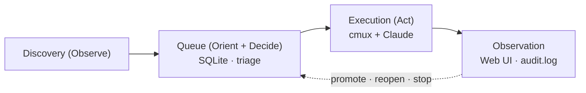

# marunage

English version: [README.md](./README.md)

> 丸投げする、でも手放さない。Slack の通知、GitHub の issue、カレンダー、
> メールを Claude Code の自律セッションに委譲しつつ、観察・介入・巻き戻しを
> 常にワンアクションで可能にしておきます。

[](https://github.com/haruotsu/marunage/actions/workflows/ci.yml)
[](./LICENSE)

`marunage`（「丸投げ」由来）は、[Claude Code](https://www.anthropic.com/claude-code)
のための単一バイナリ OSS OODA ループ実行基盤です。Gmail / Calendar / Slack /
GitHub / Google Tasks / Notion / Markdown TODO を巡回し、カスタマイズ可能な
スキルで判定して、生き残ったタスクを分離された対話型
[`cmux`](https://github.com/manaflow-ai/cmux) ワークスペースへ流し込みます。
1 タスク = 1 Claude セッションで、完了後もセッションは残るので、いつでも
介入できます。

## 不変条件

| 不変条件         | 意味                                                                                  |
| ---------------- | ------------------------------------------------------------------------------------- |
| No silent loss   | 発見したアイテムは必ず SQLite に保存。skip されても `promote` するまで残る。          |
| No silent run    | すべての dispatch は `audit.log` と `judgment_reason` に記録される。                  |
| Reversibility    | すべての状態遷移は可逆（`done` → `pending`、`skipped` → `pending`、…）。              |
| Idempotency      | discovery を何度走らせても重複登録しない: `(source, external_id)` は UNIQUE。         |
| Crash safety     | SQLite WAL + atomic sentinel による完了検知。                                         |

## How it works



1 task = 1 cmux ワークスペース = 1 対話型 Claude セッション。`claude -p` の
ワンショットは使わないので、完了後に attach して会話を続けられます。

## 必要なツール

| ツール | 必須条件 | インストール |
|--------|----------|-------------|
| [Claude Code](https://claude.ai/download) (`claude`) | 常に必須 | claude.ai からダウンロード または `npm i -g @anthropic-ai/claude-code` |
| [cmux](https://github.com/manaflow-ai/cmux) | 常に必須 | cmux README の手順を参照 |
| Go 1.25+ | ソースからビルドする場合 | [go.dev/dl](https://go.dev/dl/) |
| Python 3.11+ | 常に必須 | 多くの環境にプリインストール済み。`brew install python` / `apt install python3` |
| `sqlite3` | 常に必須 | 多くの環境にプリインストール済み。`brew install sqlite` / `apt install sqlite3` |
| `gh`（GitHub CLI） | GitHub ソース使用時のみ | `brew install gh` / [cli.github.com](https://cli.github.com) |
| `gws`（Google Workspace CLI） | Gmail / Calendar / Tasks 使用時のみ | [gws README](https://github.com/haruotsu/gws) 参照 |
| `jq` | 推奨 | `brew install jq` / `apt install jq` |

インストール後に `marunage doctor` を実行すると、セットアップ状況を一括確認できます。

## クイックスタート

**推奨 — ビルド済みリリースバイナリ**（Next.js Web UI 付き）:

```sh
# 以下から OS に合ったバイナリをダウンロード:
# https://github.com/haruotsu/marunage/releases
```

**ソースからビルド**（Web UI には Node.js 22+ が必要）:

```sh
git clone https://github.com/haruotsu/marunage
cd marunage
make build           # Web UI + Go バイナリを一括ビルド
./bin/marunage init  # 以下に続く
```

> `go install github.com/haruotsu/marunage/cmd/marunage@latest` でも CLI は動きますが、
> Web UI は HTML テンプレート版になります（Next.js なし）。
> フルの体験にはリリースバイナリか `make build` を使ってください。

```sh
marunage init              # ~/.marunage/ 初期化、SQLite、permission mode 選択
marunage doctor            # claude / cmux / python / sqlite3 / gh / gws / jq の確認
marunage setup --skills    # バンドルされた Skills を導入
marunage loop              # discover → dispatch → render を定期実行
marunage web               # http://127.0.0.1:7777
```

デーモン運用:

```sh
marunage daemon install    # LaunchAgent (macOS) / systemd-user unit (Linux)
marunage daemon start
marunage daemon logs -f
```

## Configuration

`~/.marunage/config.toml` が正本です。手編集、
`marunage config set | edit | wizard`、Web UI から編集でき、すべてスキーマ
検証 + atomic swap されます。

```toml
[core]
max_parallel = 3
default_cwd = "~/works"

[secrets]
backend = "auto"   # keyring → pass → age → 0600 file → env

[discovery]
interval = "10m"
sources_enabled = ["markdown", "github"]

[execution]
permission_mode = "bypass"   # bypass | default | acceptEdits | plan | custom
allowed_cwd_prefixes = ["~/works", "~/src"]
```

シークレットは `config.toml` には一切書きません。

## Development

必要なもの: Go 1.25+、Node.js 22+、`make`、
[`golangci-lint`](https://golangci-lint.run/welcome/install/)。

```sh
git clone https://github.com/haruotsu/marunage
cd marunage

make build      # Web UI + Go バイナリ → ./bin/marunage（Node.js 22+ が必要）
make test       # go test ./...
make lint       # golangci-lint run ./...
make fmt-check  # gofmt 差分があれば fail
```

`make build` はコンパイル時に Next.js の静的エクスポートをバイナリに埋め込みます。
そのため `./bin/marunage web` を実行するだけで Web UI が表示されます。追加の手順は不要です。

> **Go のみのビルド**（Web UI なし・Node.js 不要）：`make build-go`

### フロントエンド開発（ホットリロードあり）

```sh
make web-install       # npm ci（初回のみ）
make web-dev           # Next.js dev server → http://localhost:3000
# 別ターミナルで：
./bin/marunage web     # Go API → http://localhost:7777
```

CI は push / PR ごとに Go と Web UI（lint・型チェック・ビルド）の両方を検証します。

## Community

- セキュリティ報告 → [SECURITY.md](./SECURITY.md)（公開 issue は避ける）
- 行動 → [Code of Conduct](./CODE_OF_CONDUCT.md)
- バグ報告・機能要望 → [issue テンプレート](./.github/ISSUE_TEMPLATE)
- リリース履歴 → [CHANGELOG.md](./CHANGELOG.md)

## License

[MIT](./LICENSE) © Haruto Yokoyama and contributors.
