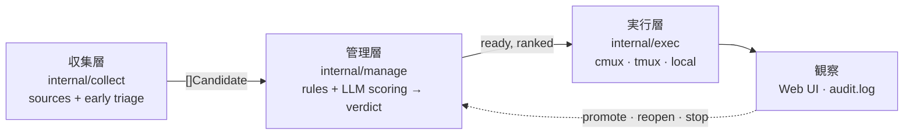

# marunage

English version: [README.md](./README.md)

> 丸投げする、でも手放さない。Slack の通知、GitHub の issue、カレンダー、
> メールを Claude Code の自律セッションに委譲しつつ、観察・介入・巻き戻しを
> 常にワンアクションで可能にしておきます。

[](https://github.com/haruotsu/marunage/actions/workflows/ci.yml)
[](./LICENSE)

`marunage`（「丸投げ」由来）は、[Claude Code](https://www.anthropic.com/claude-code)
のための単一バイナリ OSS OODA ループ実行基盤です。Gmail / Calendar / Slack /
GitHub / Google Tasks / Notion / Markdown TODO を**収集層**で巡回し、各アイテムを
**管理層**で「いまやるべき（`ready`）／あとで（`hold`・`defer`）／人間がやるべき
（`needs-human`）／そもそもやらない（`drop`）」に仕分けし、`ready` だけを
差し替え可能な**実行層**へ流し込みます。既定は分離された対話型
[`cmux`](https://github.com/manaflow-ai/cmux) ワークスペース（`tmux` やローカル
プロセスにも切替可）で、1 タスク = 1 Claude セッション。完了後もセッションは
残るので、いつでも介入できます。

## 不変条件

| 不変条件         | 意味                                                                                  |
| ---------------- | ------------------------------------------------------------------------------------- |
| No silent loss   | 発見したアイテムは必ず SQLite に保存。skip されても `promote` するまで残る。          |
| No silent run    | すべての dispatch は `audit.log` と `judgment_reason` に記録される。                  |
| Reversibility    | すべての状態遷移は可逆（`done` → `pending`、`skipped` → `pending`、…）。              |
| Idempotency      | discovery を何度走らせても重複登録しない: `(source, external_id)` は UNIQUE。         |
| Crash safety     | SQLite WAL + atomic sentinel による完了検知。                                         |

## How it works

marunage は単一の SQLite 正本（`~/.marunage/tasks.db`）を囲む 3 層構成です:



- **収集層**（`internal/collect`）は有効化された各ソースから生メッセージを集めて
  `Candidate` に正規化し、明らかなノイズ（広告・GitHub 通知メール）は LLM を
  呼ぶ前に early triage で `drop` します。
- **管理層**（`internal/manage`）が第二の関門です。決定的なルールエンジン
  （依存・締切・cwd ポリシー・重複・ロック）と任意の LLM スコアリングが、各候補に
  **verdict**（`ready` / `hold` / `defer` / `needs-human` / `drop`）を下し、`ready` を
  順位づけします。dispatch されるのは `ready` のみで、それ以外は保留・エスカレート・
  skip され、決して silently には失われません（No silent loss）。
- **実行層**（`internal/exec`）は backend 非依存の `Executor` インターフェース越しに
  `ready` タスクを実行します。既定 backend は cmux で、`tmux` / `local` も同梱、
  `[execution] executor` で選択します。

1 タスク = 1 ワークスペース = 1 対話型 Claude セッション。`claude -p` の
ワンショットは使わないので、完了後に attach して会話を続けられます。

| verdict | 意味 | 落ち先 |
| ------- | ---- | ------ |
| `ready` | いまやる — rank 順に dispatch | `pending`（dispatch 対象） |
| `hold` | 依存待ち。条件成立で自動昇格 | `pending`（保留） |
| `defer` | 価値はあるが今じゃない | `pending`（保留） |
| `needs-human` | 情報不足／人間・承認案件 | `waiting_human` |
| `drop` | スコープ外・重複・ノイズ | `skipped` |

## 必要なツール

| ツール | 必須条件 | インストール |
|--------|----------|-------------|
| [Claude Code](https://claude.ai/download) (`claude`) | 常に必須 | claude.ai からダウンロード または `npm i -g @anthropic-ai/claude-code` |
| [cmux](https://github.com/manaflow-ai/cmux) | 常に必須 | cmux README の手順を参照 |
| Go 1.25+ | ソースからビルドする場合 | [go.dev/dl](https://go.dev/dl/) |
| Python 3.11+ | 常に必須 | 多くの環境にプリインストール済み。`brew install python` / `apt install python3` |
| `sqlite3` | 常に必須 | 多くの環境にプリインストール済み。`brew install sqlite` / `apt install sqlite3` |
| `gh`（GitHub CLI） | GitHub ソース使用時のみ | `brew install gh` / [cli.github.com](https://cli.github.com) |
| `gws`（Google Workspace CLI） | Gmail / Calendar / Tasks 使用時のみ | [gws README](https://github.com/haruotsu/gws) 参照 |
| `jq` | 推奨 | `brew install jq` / `apt install jq` |

インストール後に `marunage doctor` を実行すると、セットアップ状況を一括確認できます。

## クイックスタート

**推奨 — ビルド済みリリースバイナリ**（Next.js Web UI 付き）:

```sh
# 以下から OS に合ったバイナリをダウンロード:
# https://github.com/haruotsu/marunage/releases
```

**ソースからビルド**（Web UI には Node.js 22+ が必要）:

```sh
git clone https://github.com/haruotsu/marunage
cd marunage
make build           # Web UI + Go バイナリを一括ビルド
sudo make install    # バイナリを /usr/local/bin にコピー（変更する場合: INSTALL_DIR=~/bin make install）
```

> `go install github.com/haruotsu/marunage/cmd/marunage@latest` でも CLI は動きますが、
> Web UI は HTML テンプレート版になります（Next.js なし）。
> フルの体験にはリリースバイナリか `make build` を使ってください。

```sh
marunage init              # ~/.marunage/ 初期化、SQLite、permission mode 選択
marunage doctor            # claude / cmux / python / sqlite3 / gh / gws / jq の確認
marunage config            # ディスカバリーソースを対話型 wizard で選択
marunage setup --skills    # バンドルされた Skills を導入
marunage loop              # discover → dispatch → render を定期実行
marunage web               # http://127.0.0.1:7777
```

デーモン運用（`~/.marunage/` の pidfile で管理されるバックグラウンド `marunage loop`）:

```sh
marunage daemon start      # バックグラウンドでループを起動
marunage daemon status     # 稼働状況（pid）
marunage daemon logs -f    # ~/.marunage/logs/daemon.log を tail
marunage daemon stop       # SIGTERM（10秒後 SIGKILL にエスカレート）
```

ログイン時に自動起動したい場合は、`marunage daemon start` をご自身の
LaunchAgent (macOS) / systemd-user unit (Linux) でラップしてください
（marunage 自体はこれらのファイルを生成しません）。

## Configuration

`~/.marunage/config.toml` が正本です。手編集、
`marunage config set | edit | wizard`、Web UI から編集でき、すべてスキーマ
検証 + atomic swap されます。

```toml
[core]
max_parallel = 3
default_cwd = "~/works"

[secrets]
backend = "auto"   # keyring → pass → age → 0600 file → env

[discovery]
interval = "10m"
sources_enabled = ["markdown", "github"]

[manage]
enabled = true
llm_scoring = false   # 既定はルールのみ。LLM で ready 順序づけする場合 true

[execution]
executor = "cmux"            # cmux | tmux | local
permission_mode = "bypass"   # bypass | default | acceptEdits | plan | custom
allowed_cwd_prefixes = ["~/works", "~/src"]
```

管理層の verdict → status マッピングやルールのトグルは `[manage.rules]` /
`[manage.verdicts]` 配下にあります。LLM スコアリングは `marunage setup --skills` で
導入されるカスタマイズ可能な `marunage-manage` スキルを使います。

シークレットは `config.toml` には一切書きません。

## Development

必要なもの: Go 1.25+、Node.js 22+、`make`、
[`golangci-lint`](https://golangci-lint.run/welcome/install/)。

```sh
git clone https://github.com/haruotsu/marunage
cd marunage

make build      # Web UI + Go バイナリ → ./bin/marunage（Node.js 22+ が必要）
make test       # go test ./...
make lint       # golangci-lint run ./...
make fmt-check  # gofmt 差分があれば fail
```

`make build` はコンパイル時に Next.js の静的エクスポートをバイナリに埋め込みます。
そのため `./bin/marunage web` を実行するだけで Web UI が表示されます。追加の手順は不要です。

> **Go のみのビルド**（Web UI なし・Node.js 不要）：`make build-go`

### フロントエンド開発（ホットリロードあり）

```sh
make web-install       # npm ci（初回のみ）
make web-dev           # Next.js dev server → http://localhost:3000
# 別ターミナルで：
./bin/marunage web     # Go API → http://localhost:7777
```

CI は push / PR ごとに Go と Web UI（lint・型チェック・ビルド）の両方を検証します。

## Community

- セキュリティ報告 → [SECURITY.md](./SECURITY.md)（公開 issue は避ける）
- 行動 → [Code of Conduct](./CODE_OF_CONDUCT.md)
- バグ報告・機能要望 → [issue テンプレート](./.github/ISSUE_TEMPLATE)
- リリース履歴 → [CHANGELOG.md](./CHANGELOG.md)

## License

[MIT](./LICENSE) © Haruto Yokoyama and contributors.
