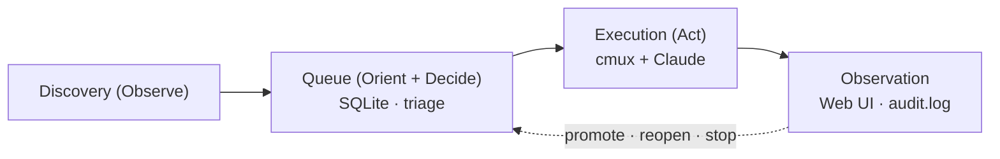

# marunage

Japanese version: [README.ja.md](./README.ja.md)

> Delegate, don't abandon. Hand off Slack pings, GitHub issues, calendar
> nudges, and emails to autonomous Claude Code sessions — while keeping
> observation, intervention, and rollback one keystroke away.

[](https://github.com/haruotsu/marunage/actions/workflows/ci.yml)
[](https://pkg.go.dev/github.com/haruotsu/marunage)
[](./LICENSE)

`marunage` (Japanese for "to delegate completely") is a single-binary,
OSS OODA-loop runner for
[Claude Code](https://www.anthropic.com/claude-code). It polls your inboxes
(Gmail / Calendar / Slack / GitHub / Google Tasks / Notion / Markdown TODOs),
triages each item with a customisable skill, and dispatches survivors into
isolated interactive [`cmux`](https://github.com/manaflow-ai/cmux)
workspaces — one Claude session per task, left alive after completion so
you can step in at any time.

## Invariants

| Invariant         | What it means                                                                          |
| ----------------- | -------------------------------------------------------------------------------------- |
| No silent loss    | Every discovered item lands in SQLite; skipped tasks stay until you `promote` them.    |
| No silent run     | Every dispatch writes to `audit.log` and stores a `judgment_reason`.                   |
| Reversibility     | Every state transition is reversible (`done` → `pending`, `skipped` → `pending`, …).   |
| Idempotency       | Re-running discovery never duplicates tasks: `(source, external_id)` is UNIQUE.        |
| Crash safety      | SQLite WAL + atomic sentinel for completion detection.                                 |

## How it works



1 task = 1 cmux workspace = 1 interactive Claude session. The runtime never
uses `claude -p` one-shots, so you can attach and continue the conversation
after the task completes.

## Quickstart

```sh
go install github.com/haruotsu/marunage/cmd/marunage@latest

marunage init              # ~/.marunage/, SQLite, pick a permission mode
marunage doctor            # check claude / cmux / sqlite3 / gh / gws / jq
marunage setup             # install skills, authenticate sources
marunage loop              # discover → dispatch → render on a timer
marunage web               # http://127.0.0.1:7777
```

Run as a daemon:

```sh
marunage daemon install    # LaunchAgent (macOS) or systemd-user unit (Linux)
marunage daemon start
marunage daemon logs -f
```

## Configuration

`~/.marunage/config.toml` is the source of truth. Edit by hand, via
`marunage config set | edit | wizard`, or from the Web UI — every write is
schema-validated and atomically swapped.

```toml
[core]
max_parallel = 3
default_cwd = "~/works"

[secrets]
backend = "auto"   # keyring → pass → age → 0600 file → env

[discovery]
interval = "10m"
sources_enabled = ["markdown", "github"]

[execution]
permission_mode = "bypass"   # bypass | default | acceptEdits | plan | custom
allowed_cwd_prefixes = ["~/works", "~/src"]
```

Secrets are never written to `config.toml`.

## Development

Requirements: Go 1.25+, `make`,
[`golangci-lint`](https://golangci-lint.run/welcome/install/).

```sh
git clone https://github.com/haruotsu/marunage
cd marunage

make build      # ./bin/marunage
make test       # go test ./...
make lint       # golangci-lint run ./...
make fmt-check  # fail on gofmt diffs
```

CI runs the equivalent of `make fmt-check vet lint test build` on every
push and pull request.

## Community

- Security reports → [SECURITY.md](./SECURITY.md) (do not open public issues)
- Behaviour → [Code of Conduct](./CODE_OF_CONDUCT.md)
- Bug reports & feature requests → [issue templates](./.github/ISSUE_TEMPLATE)
- Release history → [CHANGELOG.md](./CHANGELOG.md)

## License

[MIT](./LICENSE) © Haruto Yokoyama and contributors.
