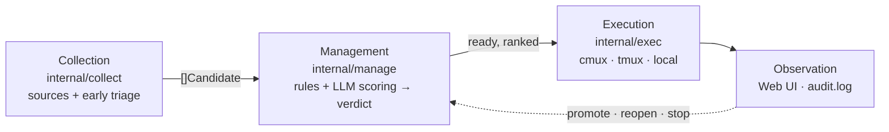

# marunage

Japanese version: [README.ja.md](./README.ja.md)

> Delegate, don't abandon. Hand off Slack pings, GitHub issues, calendar
> nudges, and emails to autonomous Claude Code sessions — while keeping
> observation, intervention, and rollback one keystroke away.

[](https://github.com/haruotsu/marunage/actions/workflows/ci.yml)
[](./LICENSE)

`marunage` (Japanese for "to delegate completely") is a single-binary,
OSS OODA-loop runner for
[Claude Code](https://www.anthropic.com/claude-code). It polls your inboxes
(Gmail / Calendar / Slack / GitHub / Google Tasks / Notion / Markdown TODOs)
through a **collection layer**, runs every item past a **management layer**
that decides whether it is something to do *now* (`ready`), *later* (`hold` /
`defer`), *by a human* (`needs-human`), or *not at all* (`drop`), and then
hands the `ready` ones to a pluggable **execution layer** — by default an
isolated interactive [`cmux`](https://github.com/manaflow-ai/cmux) workspace
(or `tmux` / a local process), one Claude session per task, left alive after
completion so you can step in at any time.

## Invariants

| Invariant         | What it means                                                                          |
| ----------------- | -------------------------------------------------------------------------------------- |
| No silent loss    | Every discovered item lands in SQLite; skipped tasks stay until you `promote` them.    |
| No silent run     | Every dispatch writes to `audit.log` and stores a `judgment_reason`.                   |
| Reversibility     | Every state transition is reversible (`done` → `pending`, `skipped` → `pending`, …).   |
| Idempotency       | Re-running discovery never duplicates tasks: `(source, external_id)` is UNIQUE.        |
| Crash safety      | SQLite WAL + atomic sentinel for completion detection.                                 |

## How it works

marunage is built from three layers around a single SQLite source of truth
(`~/.marunage/tasks.db`):



- **Collection** (`internal/collect`) gathers raw messages from every enabled
  source, normalises them to `Candidate`s, and early-triages obvious noise
  (ads, GitHub notification mail) straight to `drop` — before paying for any
  LLM call.
- **Management** (`internal/manage`) is the second gate. A deterministic rule
  engine (dependencies, deadlines, cwd policy, duplicates, locks) plus an
  optional LLM scoring pass assigns each candidate a **verdict** —
  `ready` / `hold` / `defer` / `needs-human` / `drop` — and ranks the `ready`
  ones. Only `ready` tasks are dispatched; everything else is held,
  escalated, or skipped (never silently lost).
- **Execution** (`internal/exec`) runs each `ready` task behind a
  backend-agnostic `Executor` interface. cmux is the default backend;
  `tmux` and `local` ship too, selected with `[execution] executor`.

1 task = 1 workspace = 1 interactive Claude session. The runtime never uses
`claude -p` one-shots, so you can attach and continue the conversation after
the task completes.

| Verdict | Meaning | Lands as |
| ------- | ------- | -------- |
| `ready` | Do it now — dispatched in rank order | `pending` (dispatched) |
| `hold` | Blocked on a dependency; auto-promotes when it clears | `pending` (held) |
| `defer` | Worth doing, but not now | `pending` (held) |
| `needs-human` | Missing info, or a human/approval call | `waiting_human` |
| `drop` | Out of scope, duplicate, or noise | `skipped` |

## Prerequisites

| Tool | Required | Install |
|------|----------|---------|
| [Claude Code](https://claude.ai/download) (`claude`) | Always | Download from claude.ai or `npm i -g @anthropic-ai/claude-code` |
| [cmux](https://github.com/manaflow-ai/cmux) | Always | See cmux README for install instructions |
| Go 1.25+ | To build from source | [go.dev/dl](https://go.dev/dl/) |
| Python 3.11+ | Always | Usually pre-installed; `brew install python` / `apt install python3` |
| `sqlite3` | Always | Usually pre-installed; `brew install sqlite` / `apt install sqlite3` |
| `gh` (GitHub CLI) | GitHub source only | `brew install gh` / [cli.github.com](https://cli.github.com) |
| `gws` (Google Workspace CLI) | Gmail / Calendar / Tasks only | See [gws README](https://github.com/haruotsu/gws) |
| `jq` | Recommended | `brew install jq` / `apt install jq` |

Run `marunage doctor` after install to verify your setup.

## Quickstart

**Recommended — pre-built release binary** (includes the full Next.js web UI):

```sh
# Download the latest release binary for your OS from:
# https://github.com/haruotsu/marunage/releases
```

**Or build from source** (requires Node.js 22+ for the web UI):

```sh
git clone https://github.com/haruotsu/marunage
cd marunage
make build           # builds web UI + Go binary in one step
sudo make install    # copies binary to /usr/local/bin (override: INSTALL_DIR=~/bin make install)
```

> `go install github.com/haruotsu/marunage/cmd/marunage@latest` works for the CLI,
> but the web UI will be the built-in HTML template version (no Next.js).
> Use a release binary or `make build` for the full experience.

```sh
marunage init              # ~/.marunage/, SQLite, pick a permission mode
marunage doctor            # check claude / cmux / python / sqlite3 / gh / gws / jq
marunage config            # pick discovery sources via interactive wizard
marunage setup --skills    # install the bundled Skills
marunage loop              # discover → dispatch → render on a timer
marunage web               # http://127.0.0.1:7777
```

Run as a daemon:

```sh
marunage daemon install    # LaunchAgent (macOS) or systemd-user unit (Linux)
marunage daemon start
marunage daemon logs -f
```

## Configuration

`~/.marunage/config.toml` is the source of truth. Edit by hand, via
`marunage config set | edit | wizard`, or from the Web UI — every write is
schema-validated and atomically swapped.

```toml
[core]
max_parallel = 3
default_cwd = "~/works"

[secrets]
backend = "auto"   # keyring → pass → age → 0600 file → env

[discovery]
interval = "10m"
sources_enabled = ["markdown", "github"]

[manage]
enabled = true
llm_scoring = false   # rules only by default; turn on for LLM ready-ordering

[execution]
executor = "cmux"            # cmux | tmux | local
permission_mode = "bypass"   # bypass | default | acceptEdits | plan | custom
allowed_cwd_prefixes = ["~/works", "~/src"]
```

The management layer's verdict → status mapping and rule toggles live under
`[manage.rules]` / `[manage.verdicts]`; LLM scoring uses the customisable
`marunage-manage` skill installed by `marunage setup --skills`.

Secrets are never written to `config.toml`.

## Development

Requirements: Go 1.25+, Node.js 22+, `make`,
[`golangci-lint`](https://golangci-lint.run/welcome/install/).

```sh
git clone https://github.com/haruotsu/marunage
cd marunage

make build      # web UI + Go binary → ./bin/marunage (requires Node.js 22+)
make test       # go test ./...
make lint       # golangci-lint run ./...
make fmt-check  # fail on gofmt diffs
```

`make build` embeds the Next.js static export into the binary at compile time,
so `./bin/marunage web` serves the full web UI with no extra steps.

> **Go-only build** (no web UI, no Node.js required): `make build-go`

### Hot-reload dev mode

For frontend development with instant refresh:

```sh
make web-install       # npm ci (once)
make web-dev           # Next.js dev server → http://localhost:3000
# In another terminal:
./bin/marunage web     # Go API → http://localhost:7777
```

CI runs lint, type-check, and build for both Go and the web UI on every
push and pull request.

## Community

- Security reports → [SECURITY.md](./SECURITY.md) (do not open public issues)
- Behaviour → [Code of Conduct](./CODE_OF_CONDUCT.md)
- Bug reports & feature requests → [issue templates](./.github/ISSUE_TEMPLATE)
- Release history → [CHANGELOG.md](./CHANGELOG.md)

## License

[MIT](./LICENSE) © Haruto Yokoyama and contributors.
