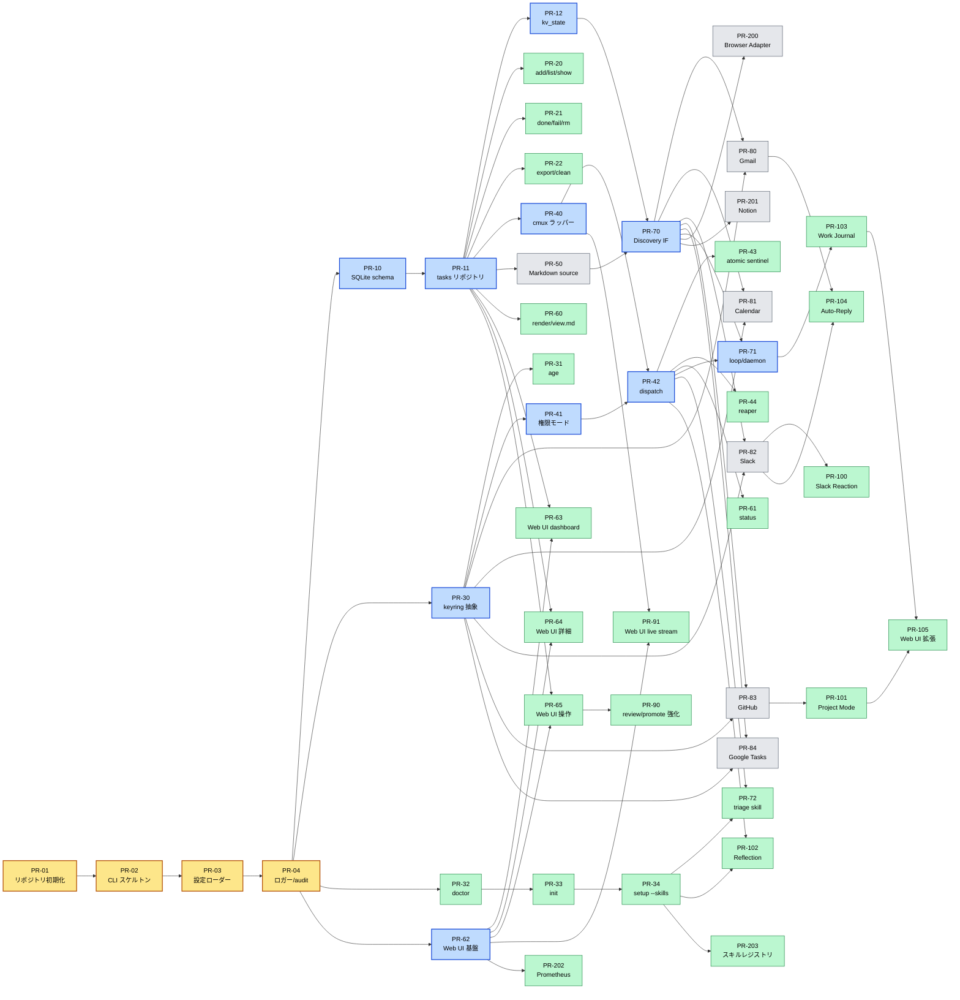
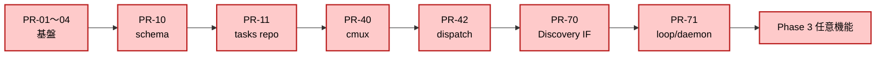
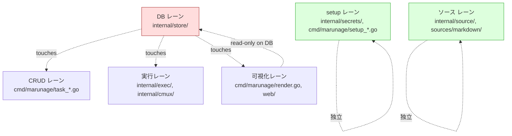
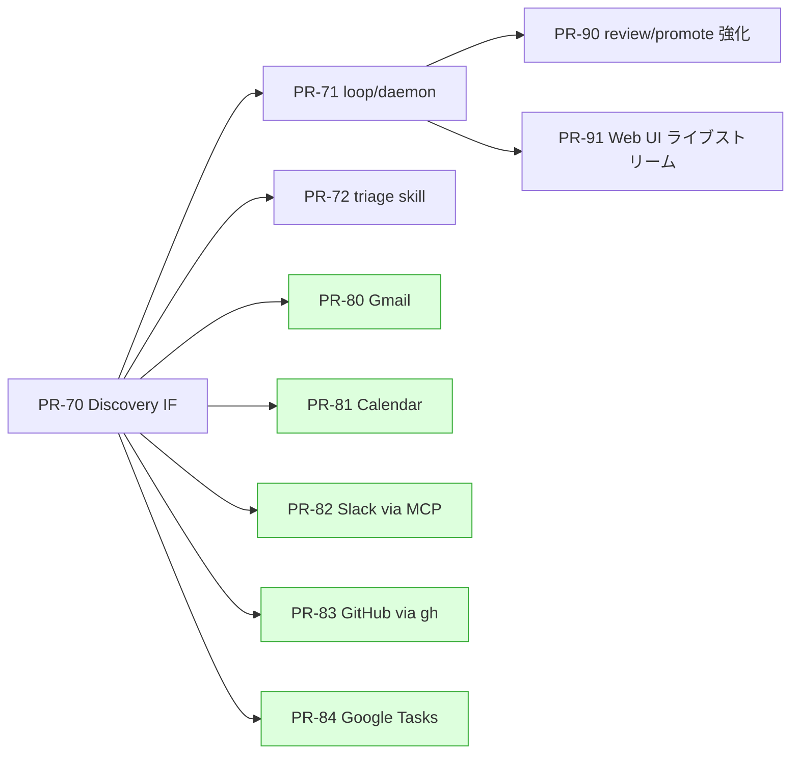
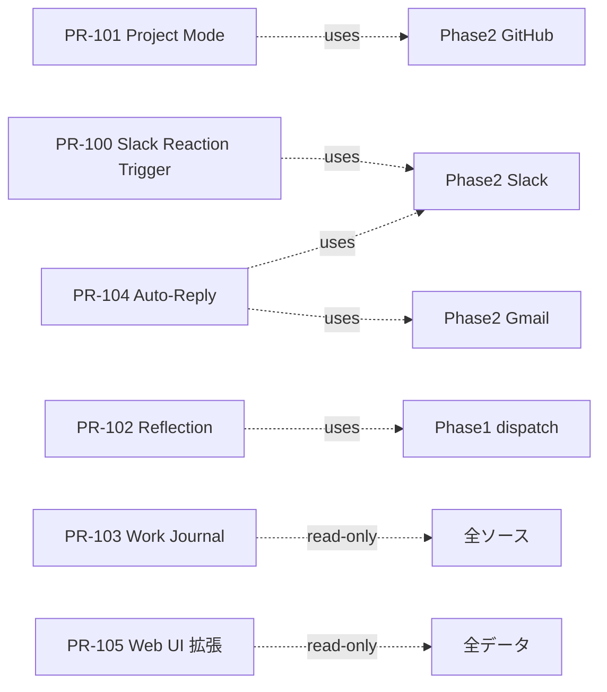

# marunage — PR 分割計画書

> 本書は `docs/requirement.md` を実装に落とし込むための PR 分割計画である。
> 各 PR は「**並列で進められる最小単位**」を意識して切り、依存関係はマーメイド図で可視化している。
> チェックボックスは「PR がマージされた」状態を示す。
>
> 凡例（レーン分類）：
> - **[基盤]** — 後続のほぼ全ての PR が依存する。最初に直列で入れる
> - **[機能]** — 基盤の上に並列で進められる
> - **[UI]** — Web UI / cmux render など可視化レイヤ
> - **[ソース]** — Discovery プラグイン（互いにコンフリクトしない）
> - **[品質]** — テスト・CI・ドキュメント

---

## 全体像（全 PR の依存関係と並列性）

> **読み方：**
> - 矢印 `A --> B` は「A がマージされてから B 着手」の依存
> - 同じ縦列のノードは **同時に着手可能**
> - 色：[黄] = 全員ブロッカー / [青] = レーンの起点 / [緑] = 並列で走れる葉ノード / [灰] = ソースプラグイン

### この図から読み取れる「並列開発の波」

| 波 | 同時に着手できる PR | 直前のブロッカー |
| --- | ------------------ | ---------------- |
| 第1波 | PR-01 → PR-02 → PR-03 → PR-04（直列） | なし |
| 第2波 | PR-10、PR-30、PR-32 を **同時開始** | PR-04 |
| 第3波 | PR-11 完了で PR-20/21/22/40/50/60/63/64/65、PR-30 完了で PR-31/41 が**一気に並列展開** | PR-11 / PR-30 |
| 第4波 | PR-42 完了で PR-43/44/61/71/72/102 が並列実行可 | PR-42 |
| 第5波 | PR-70 完了で **5 つのソース PR (PR-80〜84) が完全並列** | PR-70 |
| 第6波 | Phase 3 の 6 PR は概ね独立。Phase 2 の対応ソースだけ前提 | 各 Phase 2 ソース |
| 第7波 | Phase 4 は常時並列可 | Phase 2 IF |

### クリティカルパス（最短ライン）

**このパス上の PR は他の作業を遅延させるため最優先で着手する。** 周辺レーン（setup / 可視化 / ソース）はクリティカルパスを邪魔せず並列で進められる。

---

## Phase 0: リポジトリ基盤（直列・1〜2 日）

> 後続 PR の土台。**ここだけは並列にしない。** PR-01 → 02 → 03/04 の順で入れる。

### [基盤] PR-01 リポジトリ初期化 ✅ DONE

- [x] `go.mod` 作成（Go 最新版）
- [x] ディレクトリ構成（`cmd/marunage/`, `internal/`, `pkg/`, `web/`）
- [x] `Makefile`（`make build / test / lint`）
- [x] `golangci-lint` / `gofmt` の CI 整備
- [x] `.editorconfig` / `.gitignore` 拡張
- [x] `README.md` を要件定義書のリンク中心に差し替え

**この PR でできるようになること：** `make build` で空のバイナリ `marunage` が生成され、`marunage --version` が動く。

### [基盤] PR-02 CLI スケルトン（cobra） ✅ DONE

- [x] `cobra` 導入、ルートコマンド `marunage`
- [x] サブコマンドの空実装（要件定義書のコマンド表に従う）
- [x] `--help` がすべてのコマンドで通る
- [x] サブコマンドのスタブにテーブルテスト

**この PR でできるようになること：** `marunage --help` で全サブコマンドが列挙される。中身は空でも UX の骨格が見える。

### [基盤] PR-03 設定ローダー（config.toml） ✅ DONE

- [x] `pelletier/go-toml/v2` ベースのローダー（`internal/config.Load` / `Save`）
- [x] スキーマ検証（`Config.Validate` ＋ `Set` 経由でも再検証）
- [x] `config get / set / edit / wizard` のプリミティブ（`get`/`set` は実装、`edit`/`wizard` はスタブのまま）
- [x] `~/.marunage/config.toml.bak.<UTC ts>` への退避＋検証失敗時のディスク非汚染（atomic tmp+rename）
- [x] `audit.log` への変更記録（`Auditor` IF と `NopAuditor` を提供。PR-04 で実体差し替え）

**この PR でできるようになること：** 後続 PR が `config.Get("execution.permission_mode")` のような形で設定を読める。

### [基盤] PR-04 ロガー / audit.log ✅ DONE

- [x] 構造化ログ（JSON Lines）出力（`internal/logging.NewLogger` / `slog` ベース、`Level` パース）
- [x] `~/.marunage/logs/daemon.log` のローテート（`internal/logging.RotatingFile`：サイズ閾値 + MaxBackups 剪定）
- [x] append-only `~/.marunage/logs/audit.log`（`internal/logging.AuditLog`、O_APPEND + 0600 + 並行安全）
- [x] PR-03 の audit IF を実装側に差し替え（`marunage config set` が `config.set` / `config.save` を audit.log に追記）

**この PR でできるようになること：** 全 PR がログを書ける。監査要件（不変条件 #2「No silent execution」）の足場が完成。

---

## Phase 1: コア（4 週・並列レーン 6 本）

> Phase 1 のゴール：**Markdown ソースから手動 add したタスクを、対話型 Claude セッションで自律実行し、Web UI で観察できる**ところまで。
> 6 本のレーンが並列に進む。各レーンの内部は概ね順序依存だが、**レーン間はほぼコンフリクトしない**ように切ってある。

### コンフリクト・マップ

> **コンフリクト原則：** DB スキーマ変更（PR-10）が走っているとき、CLI/EXEC/VIEW レーンは新カラム追加待ち。
> それ以外は別パッケージなのでマージ順序を気にせず進められる。

---

### [基盤] DB レーン（順序：10 → 11 → 12）

#### PR-10 SQLite schema + WAL ✅ DONE

- [x] `internal/store/migrations/0001_init.sql` に `tasks` / `kv_state` 定義（`internal/store/schema.sql` 単体ではなく、`embed.FS` + `PRAGMA user_version` ベースの自前 migration 機構に統合）
- [x] WAL モード強制（`Open` で DSN 経由に `journal_mode=WAL` / `synchronous=NORMAL` / `foreign_keys=ON` / `busy_timeout=5000` を付与）
- [x] migration 機構（`embed.FS` + `PRAGMA user_version`、各 migration を 1 トランザクションで版数まで含めて apply）
- [x] テスト：スキーマ作成→INSERT→SELECT の往復、`(source, external_id)` UNIQUE、kv_state upsert、reopen 越しの冪等性

**できるようになること：** `~/.marunage/tasks.db` がまっとうに作られる。

#### PR-11 tasks リポジトリ層 ✅ DONE

- [x] `Insert / Get / List / UpdateStatus / SetWorkspace` メソッド (`internal/store/tasks.go`)
- [x] `(source, external_id)` UNIQUE による idempotency (`ErrDuplicateExternalID`)
- [x] `lock_key` でのソフトロック取得 / 解放 (atomic `UPDATE ... NOT EXISTS` で probe-then-write race を排除、pending/running 両方を holder と判定)
- [x] テスト：競合 INSERT、ロック取得競合 (32 ケース、t_wada TDD で red→green→refactor)
- [x] 副次成果：typed sentinel エラー一式 (`ErrNotFound`/`ErrInvalidStatus`/`ErrLockKeyRequired` ほか)、`WithClock` による時計注入、`ListFilter` の DoS guard (上限 64)

**できるようになること：** 不変条件 #1「No silent loss」と #4「Idempotency」の DB 側実装が完成。

#### PR-12 kv_state リポジトリ層 ✅ DONE

- [x] チェックポイント保存・取得 (`internal/store/kvstate.go`：`Get` / `GetWithMeta` / `Set` を `INSERT ... ON CONFLICT(key) DO UPDATE SET ...` の UPSERT で実装、`KVEntry` に `updated_at` まで返して Discovery 側の鮮度判定を 1 クエリ化)
- [x] 原子的更新 (`CompareAndSwap`：`UPDATE ... WHERE key=? AND value=?` で atomic に checkpoint advance、missing/stale を follow-up SELECT で判別。`SetMaxOpenConns(1)` 前提を godoc とインラインコメントに明記)
- [x] 副次成果：typed sentinel (`ErrKVNotFound` / `ErrKVKeyRequired` / `ErrKVValueRequired` / `ErrKVStaleValue`)、`KVOption` を tasks 系の `Option` と分離して silently 受理を回避、`WithKVClock` で決定的タイムスタンプ注入、空 value をリジェクトして「row absent」不変条件を保護

**できるようになること：** Discovery プラグインがチェックポイントを永続化できる土台。

---

### [機能] タスク CRUD レーン（PR-11 完了後に並列開始）

#### PR-20 `add` / `list` / `show` ✅ DONE

- [x] `marunage add <title>` 必須・任意フラグ (`internal/cli/task_add.go`：`--body` / `--body-stdin` / `--body-edit` を排他 (`MarkFlagsMutuallyExclusive`)、`--source` (デフォルト `manual`)、`--cwd`、`--priority`、`--notes` は `json.Valid` で事前検証)
- [x] `marunage list --status / --source` (`internal/cli/task_list.go`：`--status` / `--source` を `StringSliceVar`、デフォルトは `pending,running`、`--limit`、`--json` 出力、tabwriter のテーブル出力)
- [x] `marunage show <id>` (`internal/cli/task_show.go`：`strconv.ParseInt` で id 検証、`--json`、`store.ErrNotFound` を `Task #<id> not found.` に変換し exit 1)
- [x] テスト：DB に対する E2E（インメモリ SQLite）(`internal/cli/task_*_test.go`：29 ケース、t_wada TDD で red→green→refactor)
- [x] 副次成果：`taskRepoFactory` / `stdinReaderHook` を doctor.go の `withDoctorRuntime` パターンと同じ流儀で package-private hook 化、`taskJSON` 共通シリアライザで snake_case + RFC3339 + zero time = null の安定 wire shape を pin、`SilenceErrors` 契約を回帰防止テストで pin

**できるようになること：** タスクを手で投入して見られる。要件定義書のコマンド表で最も基本のセット。

#### PR-21 `done` / `fail` / `rm` / `promote` / `reopen` ✅ DONE (PR #18)

- [x] `marunage done <id>` / `fail <id>` / `rm <id>` / `promote <id>` / `reopen <id>` の本実装 (各 `internal/cli/task_*.go`、`task_repo.go` の hook 流儀踏襲)
- [x] 状態遷移バリデーション (`store.TaskRepo.TransitionStatus` + `allowedTransitions` map: `pending/running/waiting_human → done/fail`、`done/failed → pending` (reopen)、`skipped → pending` (promote)。`pending → running` (PR-42 dispatch 責務) と `any → waiting_human` (PR-41 escalation 責務) と `any → skipped` (Discovery / triage) は意図的に除外)
- [x] 鏡像同期 hook の interface (`internal/cli/mirror.go` の `cli.Mirror` IF: `OnDone` / `OnDelete` / `OnReopen`、production は `noopMirror{}` を返す `productionMirrorFactory`、テスト hook は `withMirrorFactory(t, fn)`。実プラグインは PR-50 以降で差し込み)
- [x] テスト：73 個の test invocation (table-driven 含む)、`go test -race ./...` 全 green。不正遷移拒否 / `ErrNotFound` / JSON 出力 / Mirror hook 呼び出し検証を網羅
- [x] 副次成果：`internal/store/tasks.go` に `TransitionStatus` / `Delete` を追加、`ErrInvalidTransition` typed sentinel (PR-41 と並列開発のため重複定義あり、merge 時 PR-41 側の宣言に統合済み)、`internal/cli/task_transition.go` の shared runner で done/fail/promote/reopen の 4 コマンドのコード重複を排除

**できるようになること：** 不変条件 #3「Reversibility」の CLI 側実装が揃う。`marunage done #1` / `marunage reopen #1` で人間が状態を巻き戻せる。

**マージ順序の注意:** PR #17 (PR-41) と本 PR は `internal/store/tasks.go` で `ErrInvalidTransition` を重複定義 (両方が main を base に並列開発)。先にマージされた方の定義を残し、後マージ側を rebase で重複削除する。テストは両 PR とも `errors.Is` ベース判定なのでメッセージ format 違いは問題にならない。

#### PR-22 `export` / `clean` ✅ DONE (PR #19)

- [x] `export --format json|markdown`
- [x] `clean`：ws 参照が cmux 側に存在しないレコードの整理（PR-44 の reaper と機能分担を整理）

**できるようになること：** タスク履歴を持ち出せる、孤児ワークスペース参照を掃除できる。

---

### [機能] シークレット / setup レーン（DB レーンと完全独立、即並列開始可）

#### PR-30 keyring 抽象 + バックエンド自動選択 ✅ DONE

- [x] `internal/secrets/` インターフェース (`Store`: Get/Set/Delete/List/Backend、`Open`/`OpenWithAuditor`)
- [x] `keyring` / `pass` / `age` / `file` / `env` の選択ロジック (pass/age は `ErrUnsupported` のスタブ、PR-31 で実装)
- [x] `marunage config set secrets.backend` での強制指定 (`internal/config` に `[secrets].backend` を追加、auto/keyring/pass/age/file/env を validate)
- [x] テスト：各バックエンドのモックと自動選択ロジック (23 ケース、`ErrUnknownBackend` を `errors.Is` で pin)
- [x] 副次成果：`auditingStore` decorator で Set/Delete を `audit.log` に記録 (値は決して書かない)、`~/.marunage` を 0700 に narrow するセーフガード追加

**できるようになること：** 後続のソース系 PR が `secrets.Store("gmail", token)` で書ける。

#### PR-31 age バックエンドの実装 ✅ DONE (PR #27)

- [x] パスフレーズ入力プロンプト
- [x] `~/.marunage/secrets.age` への永続化
- [x] テスト：暗号化往復

**できるようになること：** GUI 無しサーバ環境でも完結。

#### PR-32 `marunage doctor [--fix]` ✅ DONE

- [x] claude / cmux / sqlite3 / python / gh / gws / jq の存在＋バージョンチェック (`internal/doctor/checks.go`、required vs. optional は `discovery.sources_enabled` から判定)
- [x] `--fix` で Homebrew/apt/dnf 経由インストール提案 (`internal/doctor/install.go`、darwin / debian-like / fedora-like / Other を `runtime.GOOS` + `/etc/os-release` で検出、印字のみで自動実行はしない)
- [x] シークレット保存先のバックエンド検出 (`internal/doctor/secrets.go`、ファイル probe のみで `internal/secrets` を import せず、PR-30 と独立にコンパイル可能)
- [x] 副次成果：`Runner` / `SecretsProbe` / `OSDetector` の差し込み可能インターフェース (テストで実バイナリ呼び出し排除)、`--json` の安定スキーマ、`marunage doctor` cobra subcommand

**できるようになること：** ユーザがインストール直後に詰まる箇所を一発診断。

#### PR-33 `marunage init` ✅ DONE (PR #22)

- [x] `~/.marunage/` 作成
- [x] 権限モード選択プロンプト（要件定義書 200-211 行）
- [x] 完了時に doctor → setup の案内

**できるようになること：** OSS としての「最初の体験」が成立。

#### PR-34 `marunage setup --skills` ✅ DONE (PR #28)

- [x] パッケージ同梱の `marunage-triage / execute / reflect` を `~/.claude/skills/` にコピー
- [x] `--diff / --force / --merge`
- [x] `--check-updates`
- [x] SKILL.md の必須セクション検証

**できるようになること：** triage / execute スキルが入っていることを保証。Phase 1 の Act フェーズが回るようになる前提が揃う。

---

### [機能] 実行（Act）レーン（PR-11 + PR-30 完了後）

#### PR-40 cmux ラッパー ✅ DONE

- [x] `cmux new-workspace --cwd / --command / --name` のラッパー (`internal/cmux/cmux.go`：`Client.NewWorkspace(NewWorkspaceOptions)` で `workspace:NNN` をパース、`ErrCmuxNotFound` / `ErrUnparseableOutput` を typed error として返す)
- [x] `cmux send` / ws-send（Enter 付き送信）(`Send`：改行 `[\r\n]+` をスペース 1 つに折り畳んでから cmux に渡す。cmux 本体が無いときは `WithFallbackBinary` の ws-send へフォールバックし primary error を診断に連鎖)
- [x] 起動完了ポーリング（最大 60s）(`WaitReady`：`ReadinessProbe` を最大 `WithStartupTimeout` (default 60s) ポーリング、`WithPollInterval` で間隔調整、context cancel で即時抜け、デフォルト probe は fail-closed (`neverReadyProbe`) で injection 忘れを silent failure にしない、`time.NewTicker(0)` panic を非正値ガードで防止)
- [x] テスト：cmux モック (`internal/cmux/cmux_test.go`：`fakeRunner` / `scriptedProbe` でテーブル駆動 13 ケース、サブテスト含めると 15 ケース、race detector clean)
- [x] 副次成果：`Runner` interface (`internal/cmux/runner.go`) で外部コマンド抽象化 (`internal/doctor/runner.go` と意図的に別物として残し境界を明確化)、functional options 一式 (`WithRunner` / `WithReadinessProbe` / `WithStartupTimeout` / `WithPollInterval` / `WithClock` / `WithFallbackBinary`)、`WithClock` の godoc に「polling は real time」明記

**できるようになること：** Go 側から cmux ワークスペースを生成・操作できる。

#### PR-41 権限モード ✅ DONE

- [x] `permission_mode` 設定 → `claude_command` 自動生成 (`internal/config/getset.go:Set` で permission_mode 変更時に `ClaudeCommandFor(mode)` を `claude_command` に同期。`custom` モードのみユーザ手書きを保持。`internal/config/getset_test.go:TestSetPermissionModeDerivesClaudeCommand` で 4 モード全部の Set 経由同期を pin)
- [x] `auto_accept_tools` ホワイトリストマッチャ (`internal/permission/matcher.go`：`Read` / `Bash(git status:*)` / `Bash(echo hello)` の 3 ルール形態をパース。`:*` は suffix-any (語境界なし、要件 "以降任意" に整合)、空 allowlist はすべて deny、malformed rule は typed sentinel `ErrEmptyRule` / `ErrUnclosedParen` / `ErrEmptyArgs` / `ErrMissingTool` で起動時失敗)
- [x] `escalate_to_human` で `status='waiting_human'` 遷移 (`store.TaskRepo.EscalateToHuman`：`running` / `waiting_human` のみ受け入れ、それ以外は `ErrInvalidTransition`。空 reason は `ErrReasonRequired`、id 不在は `ErrNotFound`。`AcquireLock` と同じ atomic UPDATE + 後続 SELECT で probe-then-write race を排除し、idempotent re-call で reason だけ refresh)
- [x] `human_wait_timeout` で `failed` への遷移 (`store.TaskRepo.ExpireWaitingHuman`：deadline 厳格 less-than (`< deadline`) で `waiting_human` のみを `failed` に bulk 遷移、戻り値=遷移件数。zero deadline は `ErrDeadlineRequired` で fail-loud、judgment_reason は post-mortem 用に保持、completed_at はスタンプしない)
- [x] 副次成果：`internal/permission` 新規パッケージ (PR-42 dispatch から `permission.New(cfg.Execution.AutoAcceptTools)` → `m.Allow(tool, args)` で auto-accept 判定可)、`store` の typed sentinel に `ErrInvalidTransition` / `ErrReasonRequired` / `ErrDeadlineRequired` 追加 (PR-21 reopen / promote、PR-44 reaper も再利用予定)

**できるようになること：** `bypass` 以外の権限モードでも自律実行が成立する素材が揃う。要件定義書 187-195 行の中核。PR-42 dispatch が `permission.Matcher` + `EscalateToHuman` + `ExpireWaitingHuman` を 1 箇所で wire すれば、auto-accept 判定 → 不一致時 escalate → タイムアウト失敗のフローが完成する。

#### PR-42 `dispatch`（コア） ✅ DONE (PR #21)

- [x] 優先度・`lock_key`・`max_parallel` を考慮したディスパッチ (`internal/dispatch/dispatch.go:Dispatcher.Run`：`store.List(Statuses=[pending], Limit=MaxParallel*4)` で priority DESC / created_at ASC / id ASC 順に取得、lock 競合行は budget を消費せずスキップ。`MaxParallel*4` は contended な先頭行で停滞しない最小ヒューリスティック。長期常駐 starvation の懸念は PR-44 reaper 着手前に再評価)
- [x] ws 参照の即書き戻し（重複ディスパッチ防止）（`SetWorkspace` を `WaitReady` より前に発行する不変条件を `TestRunWritesWorkspaceBeforeWaitReady` で probe-inside-WaitReady パターンで pin。さらに `SetStartedAt` を `UpdateStatus(running)` より前に書く順序を pin して「`status=running` ならば `started_at` stamped」の不変条件を保証 (PR-44 reaper の 24h-stuck probe 前提)）
- [x] プロンプト構築（基本指示＋ソース固有指示＋本文）（`internal/dispatch/prompt.go:BuildPrompt`：`Base → SourceSpecific → Task` の固定順、空セクションは `\n\n` 区切りごと脱落して二重空行を作らない、`SourceSkillFunc` で skill 解決を inject 可能）
- [x] 副次成果（実装）：
    - `internal/dispatch` 新規パッケージ（`Dispatcher` + functional options `WithStore` / `WithCmux` / `WithBaseSkill` / `WithClaudeCommand` / `WithLockKeys` / `WithSourceSkill` / `WithClock` / `WithAllowedCwdPrefixes` / `WithAuditor`）
    - `ResolveLockKey`：notes.lock_hint → `[execution.lock_keys]` 正規表現照合、map キー sort 済みで決定的、malformed JSON は fail-loud
    - CLI `marunage dispatch [<id>] [--max-parallel N]`（`internal/cli/dispatch.go`、`dispatcherFactoryHook` で fake 注入可）
    - `store.SetStartedAt` / `store.MarkFailedWithReason` を `tasks.go` に追加（PR-11 の comment が PR-42 のために予約していた helper、`ErrStartedAtRequired` ガード付き）
    - audit.log 配線：dispatch.start (SetWorkspace + SetStartedAt + UpdateStatus(running) 完了後) と dispatch.fail (markFailed 内) を `~/.marunage/logs/audit.log` に append (要件不変条件 #2「No silent execution」充足)
- [x] 副次成果（不変条件と policy 整合）：
    - `pending → running` は `TransitionStatus` の matrix を意図的にバイパスし `UpdateStatus` を直叩き（dispatch が唯一の issuer。policy 層に登録すると CLI / Web UI から policy 経由で running 化される導線が生まれる）
    - `judgment_reason` は dispatch 失敗時に既存値を `; ` で append（triage / EscalateToHuman の根拠を保護、requirement.md L567 の例外ポリシーを満たす）
    - cwd allowlist (`execution.allowed_cwd_prefixes`) を `dispatchOne` 冒頭で照合、不一致は dispatch 前に `failed` (要件 §687 / §774)
    - lock_key リーク防止：NewWorkspace 失敗時に `ReleaseLock` を呼び、sibling pending 行を blocked にしない
- [x] エラー方針：
    - lock 競合 (`ErrLockHeld`) → 行は pending 維持・budget 消費せず次候補へ
    - cwd allowlist 不一致 → dispatch 前に `failed` + judgment_reason append
    - ResolveLockKey malformed → `failed` + judgment_reason append
    - NewWorkspace 失敗 → 行は pending 維持・lock 解放・budget 消費せず次候補へ
    - SetWorkspace 後の WaitReady / Send 失敗 → `failed` + judgment_reason append（reaper の phantom 探索を回避）
- [x] typed sentinel error: `dispatch.ErrInvalidConfig`（構築時の必須 Option 不足）、`dispatch.ErrNotPending`（`runOne` で pending 以外を指定）。`store.ErrLockHeld` は dispatch ループ内で skip 判定に使用

**スコープ非該当（PR-42b 以降で wire する）：**
- `permission.Matcher` 連携 / `EscalateToHuman` 通電 / `on_unknown_permission` ハンドラ — bypass mode 専用の最小実装として閉じる
- prompt injection 対策（`<<source / external_id / origin>>` フェンス）
- `judgment_reason` / cmux stderr のトークンマスキング (PR-04 RedactingHandler 経路)
- `workspaceName` の UTF-8 境界（`[]rune` 化）
- 並行 `Dispatcher.Run × 2` の race テスト

**できるようになること：** `marunage dispatch` で 1 タスクが Claude セッションに投入される。`marunage dispatch <id>` で 1 件指定実行も可能。`audit.log` で全 dispatch start / fail を観察可能。

#### PR-43 atomic sentinel による完了検知 ✅ DONE (PR #23)

- [x] `.exit_code.tmp` → `mv .exit_code` パターン
- [x] ポーリング → `status='done'`
- [x] `result_summary` の保存

**できるようになること：** 不変条件 #5「Crash safety」の核。

#### PR-44 reaper（孤児・タイムアウト回収） ✅ DONE (PR #24)

- [x] cmux 側に存在しない ws 参照を `failed` に
- [x] `started_at + 24h` 超の running を警告

**できるようになること：** 長期運用時の信頼性が確保される。

---

### [ソース] 最小ソースレーン（他レーンと完全独立）

#### PR-50 Markdown source プラグイン ✅ DONE

- [x] `~/.marunage/sources/markdown/list / setup / since / add / complete / delete` (`internal/source/markdown/markdown.go`：Discovery プラグインの 6 サブコマンドを `Plugin` の Go API として実装。CLI 露出は PR-70 Discovery IF 側の責務として分離)
- [x] mtime チェックポイント (`Since`：ファイルパスごとの最終 mtime を `Checkpointer` interface 経由で永続化、PR-12 `KVStateRepo` 直 import を避けて結合点を最小化)
- [x] 双方向同期（Markdown ファイル → DB → Markdown ファイル）(`Add` / `Complete` / `Delete` で `- [ ]` / `- [x]` 行を atomic write (tmp file → rename) で書き換え、`<!-- marunage:id=xxx source=markdown -->` HTML コメントで ExternalID を永続化して再 List で同一 ID を復元)
- [x] 副次成果：`crypto/rand` 6 byte → 12 hex chars の ExternalID 生成（並行 Plugin プロセス間衝突回避）、CRLF 改行コード保持 (`detectEOL` / `stripTrailingCR`)、部分マーカー `<!-- marunage:source=upstream -->` (ID 無し) のフィールド保護、`Add` の改行入りタイトルを disk 書き込み前に `ErrInvalidTitle` でリジェクト、35 テスト全 green (race detector clean)

**できるようになること：** Phase 1 のゴール「Markdown のチェックリストから自律実行」が成立。Phase 2 のソース統合の参考実装にもなる。

---

### [UI] 可視化レーン（DB レーン完了後に並列開始）

#### PR-60 `render` / `view.md` ✅ DONE (PR #20)

- [x] `~/.marunage/view.md` 生成
- [x] cmux markdown ビューア用フォーマット

**できるようになること：** cmux 内で全タスク状況が見える。

#### PR-61 `status` / `status --watch` ✅ DONE (PR #26)

- [x] 実行中ワークスペースと最終出力
- [x] watch モードのストリーム

**できるようになること：** ターミナル 1 枚で監視できる。

#### PR-62 Web UI 基盤（FastAPI / または Go の `chi` + `templ`） ✅ DONE (PR #29)

> **要件定義書の記述ゆれメモ**：693 行で「Go の最新版」、317 行で「FastAPI（Python）」と書かれている。
> 単一バイナリ配布という要件（320 行）を優先するなら **Go ＋ HTMX** で統一するのが整合的。
> Phase 0 で技術選定を確定させ、本 PR の実装言語を決めてから着手する。

- [x] `marunage web` サブコマンド
- [x] localhost bind デフォルト
- [x] CSRF トークン
- [x] ログイン無し（ローカルモード）
- [x] SSE / WebSocket ストリーム基盤

**できるようになること：** http://localhost:7777 で空のダッシュボードが立ち上がる。

#### PR-63 Web UI ダッシュボード ✅ DONE (PR #42)

- [x] running 一覧 + 最新出力プレビュー
- [x] pending キュー（優先度順）
- [x] 直近 24 時間の done/failed/skipped サマリ
- [x] ソース別 Discovery 状況

**できるようになること：** 観察レイヤーの中核が完成。

#### PR-64 Web UI タスク詳細 ✅ DONE (PR #44)

- [x] 全フィールド表示
- [x] judgment_reason
- [x] cmux ws ディープリンク
- [x] result_summary / reflection
- [x] 該当タスクの audit.log

**できるようになること：** タスク 1 件を完全に追跡できる。

#### PR-65 Web UI 操作系 ✅ DONE (PR #43)

- [x] 手動 dispatch ボタン
- [x] promote / reopen ボタン
- [x] 手動追加フォーム
- [x] 優先度編集 / 削除
- [x] CSRF テスト

**できるようになること：** Phase 1 の Web UI 必須機能が揃う。

---

## Phase 2: 標準ソース統合（4 週）

> Phase 2 のゴール：**Gmail / Slack / GitHub からの自動 Discovery → triage → 自律実行**まで無人で回る。
> ソース PR（PR-80〜84）は **互いにコンフリクトしない**ので 5 人並列開発が可能。

### 並列開発マップ

### [基盤] PR-70 Discovery プラグインインターフェース ✅ DONE (PR #30)

- [x] `internal/source/Plugin` interface
- [x] サブコマンド契約：`list / setup / auth-status / since / add / complete / delete`
- [x] プラグインマニフェスト（`plugin.toml`）
- [x] テスト：Markdown plugin（PR-50）を IF に適合させる

**できるようになること：** ソース系 PR（PR-80 以降）が並列で書ける。

### [機能] PR-71 `loop` / `daemon` ✅ DONE (PR #40)

- [x] `marunage loop --interval 10m --once`
- [x] LaunchAgent / systemd / cron 経由の `daemon start|stop|status`
- [x] discover → dispatch → render の連結

**できるようになること：** 無人で OODA が回り始める。

### [機能] PR-72 triage スキル統合 ✅ DONE (PR #32)

- [x] `~/.claude/skills/marunage-triage/SKILL.md` 同梱版
- [x] Orient フェーズで Claude を呼び出す経路
- [x] `judgment_reason` への記録

**できるようになること：** 不変条件 #1 を満たしたまま「自分宛か」判定が動く。

### [ソース] PR-80 Gmail source（並列） ✅ DONE (PR #34)

- [x] `gws` 経由 or OAuth-local
- [x] クエリ：`is:unread to:me -label:auto-archived`
- [x] 既読化・ラベル付けの双方向同期
- [x] `gmail_last_id` チェックポイント

**できるようになること：** メールがタスクキューに並ぶ。

### [ソース] PR-81 Google Calendar source（並列） ✅ DONE (PR #35)

- [x] 当日予定の読み取り専用取得

**できるようになること：** カレンダーから定例タスクを拾える。

### [ソース] PR-82 Slack source（並列） ✅ DONE (PR #38)

- [x] Slack MCP 経由でメンション・DM 取得
- [x] `slack_last_ts` チェックポイント
- [x] DM 通知(完了報告経路)

**できるようになること：** Slack がタスクの主入口になる。

### [ソース] PR-83 GitHub source（並列） ✅ DONE (PR #31)

- [x] `gh` CLI 経由
- [x] `is:open assignee:@me` クエリ
- [x] issue/PR の updatedAt チェックポイント

**できるようになること：** Issue/PR が直接タスクになる。

### [ソース] PR-84 Google Tasks source（並列） ✅ DONE (PR #36)

- [x] Google Tasks API 双方向同期
- [x] 鏡像化

**できるようになること：** モバイルからの追加もキューに入る。

### [機能] PR-90 `review` / `promote` 強化 ✅ DONE

- [x] `marunage review --since Xd` （`--json` / `--report` フラグも含む）
- [x] Web UI 判定レビュー画面 `/review`（skipped 一覧 + Promote ボタン + `?since=` フィルタ + `GET /api/review/skipped`）
- [x] 同一理由スキップの頻発検出レポート（CLI `--report` + Web UI 頻度テーブル）

**できるようになること：** triage 精度の継続改善ループが回る。

### [UI] PR-91 Web UI ライブストリーム ✅ DONE (PR #53)

- [x] cmux ターミナル出力を WebSocket で配信
- [x] ブラウザからの `cmux send` 相当

**できるようになること：** 物理的に手元にいなくても介入できる。

---

## Phase 3: 高度機能（4 週）

> いずれも互いに**ほぼ独立**。担当を割り振って並列に進められる。

### [機能] PR-100 Slack Reaction Trigger ✅ DONE (PR #47)

- [x] `reactions.added` イベント購読 or ポーリング
- [x] 設定 reaction（例：`:todo:`）でタスク化
- [x] permalink 保存・DM 完了報告

https://github.com/harakeishi/slackhog
検証やテストはこれを使って
**できるようになること：** ワンタップでタスク化される UX が完成。

### [機能] PR-101 Project Mode ✅ DONE (PR #51)

- [x] `marunage project run <board-url>`
- [x] GitHub Projects ボード読み取り
- [x] Markdown 計画書のフェーズ × 日付順実行
- [x] 人間タスクで待機 → ボード更新で自動再開

**できるようになること：** 段階実行プロジェクトを丸投げできる。

### [機能] PR-102 Reflection フック ✅ DONE (PR #39)

- [x] `done` 直後に同一 ws へ reflection prompt
- [x] `marunage-reflect` SKILL.md
- [x] `tasks.reflection` カラム保存
- [x] サンプリング率設定

**できるようになること：** 完了タスクの品質が継続改善される。

### [機能] PR-103 Work Journal ✅ DONE (PR #50)

- [x] `marunage journal start`
- [x] 30 分ごとに Slack/Calendar/Git/GitHub/marunage を集約
- [x] `~/.marunage/journal/YYYY-MM-DD.md`
- [x] `journal-export` フォーマット

**できるようになること：** 日報・週報が自動生成される。

### [機能] PR-104 Auto-Reply スキル ✅ DONE (PR #49)

- [x] `marunage-autoreply` SKILL.md
- [x] 権限境界の設定ファイル（OK/NG カテゴリ）
- [x] `--draft-only` モード

**できるようになること：** 既知の依頼への返信が自動化される（境界の中で）。

### [UI] PR-105 Web UI 拡張 ✅ DONE (PR #48)

- [x] Project mode ボード表示
- [x] Work Journal タイムライン
- [x] メトリクスダッシュボード（タスク数推移・成功率・平均時間・ソース別）

**できるようになること：** Phase 3 の機能群が全部 GUI で見える。

---

## Phase 4: エコシステム（M4 以降・常時並列可）

### [ソース] PR-200 Browser Adapter プラグイン ✅ DONE (PR #33)

- [x] DOM scrape 系ソース（Slack saved later など）の汎用基盤
- [x] cmux browser / Playwright 抽象

**できるようになること：** API が無い SaaS にも手が届く。

### [ソース] PR-201 Notion ✅ DONE (PR #41)
MCPやCLIがあるならそれを使う。それがないならmarunageのソースにする。

- [x] サードパーティ source プラグイン
- [x] 各社 OAuth フロー

**できるようになること：** 標準ソースのカバー率が広がる。

### [機能] PR-202 Prometheus メトリクスエクスポート ✅ DONE (PR #52)

- [x] `/metrics` エンドポイント
- [x] タスク数 / 成功率 / 平均実行時間

**できるようになること：** 既存監視基盤に統合できる。

### [機能] PR-203 共有可能スキルレジストリ ✅ DONE (PR #37)

- [x] `marunage skills install <name>`
- [x] レジストリプロトコル
- [x] Web UI からのインストール

**できるようになること：** コミュニティが triage を改善し合える。

---

## 並列開発の運用ルール

### コンフリクトを避けるための原則

1. **パッケージ境界を PR と一致させる** ― 1 PR は原則 1 パッケージ追加 or 既存パッケージ内変更に閉じる
2. **DB schema 変更は PR-10 / 11 / 12 のみ** ― 後続フェーズで列追加が必要なときも独立 PR にする
3. **`config.toml` のキー追加は PR の中で完結** ― `internal/config/schema.go` への追加で済むよう設計
4. **CLI サブコマンド定義は PR-02 で空実装済み** ― 各機能 PR は `RunE` を埋めるだけにする
5. **Skills (`~/.claude/skills/marunage-*`) は PR-34 / 72 / 102 / 104 がそれぞれ別ディレクトリを担当** ― ディレクトリ単位で隔離

### TDD 実施方針（CLAUDE.md 準拠）

- 各 PR は **テストリスト → 失敗するテスト → プロダクトコード → リファクタ** の順
- DB レーン PR は SQLite インメモリでテスト、cmux ラッパーはモック注入
- Web UI PR は handler ごとの単体 + 主要画面の playwright/cmux browser での E2E

### マイルストーン定義

| マイルストーン | 含まれる PR | ユーザに約束する体験 |
| -------------- | ----------- | -------------------- |
| **M0**         | PR-01〜04 | リポジトリで `make build` が通る |
| **M1**         | PR-10〜65 | Markdown ソースから自律実行が成立、Web UI で観察可能 |
| **M2**         | PR-70〜91 | Gmail/Slack/GitHub から無人で OODA が回る |
| **M3**         | PR-100〜105 | Reaction Trigger / Project Mode / Reflection / Journal が揃う |
| **M4**         | PR-200〜203 | サードパーティ拡張・メトリクス・スキルレジストリ |

---

## 付録：レーン別オーナーシップ提案（参考）

| レーン                    | 想定担当 | コンフリクト面 |
| ------------------------- | -------- | -------------- |
| 基盤（Phase 0）           | A        | 全員ブロック   |
| DB レーン                 | A or B   | 全 PR が依存   |
| 実行レーン                | B        | DB のみ        |
| シークレット / setup レーン | C        | 完全独立       |
| ソースレーン (Phase 1/2)  | D, E …   | 完全独立（プラグイン IF 後） |
| 可視化 / Web UI レーン    | F        | DB の read のみ |

> 担当人数が少ない場合：A → B → C → F → D/E の順にレーンを直列化しても、PR 粒度は変えずに済む。
