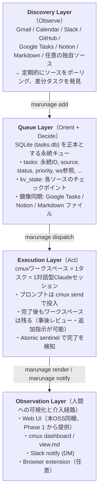

# marunage — AI自律タスク実行OSS 要件定義書

> プロダクト名 marunage は「丸投げ」に由来する。Slack・メール・GitHub から流れてくるタスクを、人間が一つひとつ捌くのではなく、安全な境界の中でエージェントに丸投げする ―― それがこのOSSが提供する体験である。「丸投げ」は無責任の意味を帯びることもあるが、本OSSにおいては「観察・介入・巻き戻しがいつでも可能な状態を保証した上で実行を委譲する」という、より精緻な意味で用いる。

---

## ビジョン

### 解決する問題

知識労働者の1日は、Slack・メール・カレンダー・GitHub・Google Tasks・各種SaaSから断続的に届くタスクで構成される。これらを人間が手動でトリアージし、1つずつ逐次処理することは非効率である。一方で、完全な自動化はAIが暴走したり、文脈を取り違えたりする。

求められているのは「人間が見ていないときは自律的に動き、必要なときはいつでも介入できる」中間状態 ―― すなわち OODA ループを高速で回し続けるエージェント常駐環境である。

### 設計原理：OODAループ

| フェーズ          | システム上の対応                                                                                                                                           |
| ----------------- | ---------------------------------------------------------------------------------------------------------------------------------------------------------- |
| Observe (観察)    | Discoveryレイヤが Gmail / Calendar / Slack / GitHub / Google Tasks 等を巡回し、新着タスクを発見する                                                        |
| Orient (情勢判断) | 発見したタスクを「自分宛か」「対応すべきか」「すでに対応済みか」で判断し、キューに投入するかスキップするかを決める                                         |
| Decide (意思決定) | 優先度・依存関係を見て、次に着手するタスクを決める                                                                                                         |
| Act (行動)        | cmuxワークスペース上に対話型 Claude セッションを起動し、プロンプトを投げて自律実行させる。完了後もワークスペースを残し、人間がいつでも介入・追加指示できる |

### 不変条件 (invariants)

OODAは雑な実装の言い訳ではない。高速にループを回すには各サイクルが堅牢に閉じている必要がある。本OSSが守るべき不変条件は以下:

1. No silent loss ― Discovery で発見したタスクは、人間が `skipped` を明示的に承認するまでDBに残る。判定漏れが起きても、データは失われない
2. No silent execution ― すべてのディスパッチは `audit.log` と `judgment_reason` に痕跡を残す。観察されない自律実行は存在しない
3. Reversibility ― すべての状態遷移は元に戻せる。`done` も人間が `pending` に戻せる。外部ストアへの破壊的操作は二段階確認
4. Idempotency ― Discovery を何度走らせても同じタスクは重複登録されない (`(source, external_id)` UNIQUE)
5. Crash safety ― プロセスが途中で死んでも、SQLite WAL と atomic sentinel により状態は一貫する

---

## システム概観

### 4レイヤーアーキテクチャ



### 対話型セッション + cmux send

本OSSは、Claude Code を `claude -p "プロンプト"` のワンショット実行で使わない。代わりに:

1. cmuxワークスペースを新規作成
2. その中で対話型 Claude セッションを起動（権限モードは設定可能、デフォルトは `claude --dangerously-skip-permissions`）
3. 起動完了を待って `cmux send` でプロンプトを貼り付けて Enter

「自律性」と「介入可能性」の両立が本プロダクトの存在意義である。

#### 用語: cmux / gws

- **cmux** ― 対話型ターミナルワークスペースを管理する別プロジェクトの CLI ツール。`cmux new-workspace` でタスクごとに隔離されたシェルを起動し、`cmux send` で外部から入力を送り、`cmux dashboard` で一覧表示できる。本 OSS は cmux が提供するワークスペース上で Claude セッションを動かす設計を取る
- **gws** ― Google Workspace CLI。Gmail / Calendar / Drive / Tasks の認証と操作を担う別プロジェクトの CLI ツール。本 OSS の google 系ソースは `gws auth` の認証情報を再利用する

---

## 機能要件

### コマンド `marunage`

| コマンド                                                                                       | 説明                                                                                            |
| ---------------------------------------------------------------------------------------------- | ----------------------------------------------------------------------------------------------- |
| `marunage init`                                                                                | カレントユーザの `~/.marunage/` を初期化、SQLite作成、設定ファイル雛形配置、権限モード選択      |
| `marunage doctor [--fix]`                                                                      | 周辺ツール (claude, cmux, gh, gws, jq) の存在とバージョンを確認。`--fix` で可能な範囲を自動導入 |
| `marunage setup [--skills] [--list\|--headless]`              | Skills インストール・認証状態確認                                                     |
| `marunage add <title> [--body TEXT\|--body-stdin\|--body-edit] [--source X] [--cwd PATH] [--priority N] [--notes ...]` | タスクを手動追加。本文は `--body` で直接、`--body-stdin` で標準入力、`--body-edit` で `$EDITOR` を起動 |
| `marunage list [--status pending\|running\|done\|failed\|skipped\|waiting_human] [--source X]` | タスク一覧。デフォルトは pending+running                                                        |
| `marunage show <id>`                                                                           | タスク詳細                                                                                      |
| `marunage rm <id>`                                                                             | タスク削除（鏡像ストアにも反映、復旧不可なため確認プロンプトあり）                              |
| `marunage done <id>` / `marunage fail <id>`                                                    | 手動で完了/失敗マーク                                                                           |
| `marunage discover [--source X] [--all] [--once]`                                              | Discovery層を1回走らせる。`loop` から内部的にも呼ばれる単体コマンド                             |
| `marunage dispatch [<id>] [--max-parallel N]`                                                  | キューからタスクをディスパッチ。`<id>` 省略時は優先度順に1〜N件                                 |
| `marunage run-all`                                                                             | 全 pending タスクを順次ディスパッチ                                                             |
| `marunage status`                                                                              | 実行中ワークスペースの一覧と最終出力                                                            |
| `marunage render`                                                                              | `~/.marunage/view.md` を生成（cmux markdownビューア用）                                         |
| `marunage open`                                                                                | `view.md` を cmux で開く（内部で `render` → cmux markdown viewer 起動）                         |
| `marunage notify [--task <id>] [--channel slack\|stdout]`                                      | 完了・失敗・waiting_human の通知を手動送信。`loop` も内部で呼ぶ                                 |
| `marunage loop [--interval 10m] [--once]`                                                      | discover → dispatch → render → notify → reaper を定期実行                                       |
| `marunage daemon start\|stop\|status`                                                          | LaunchAgent / systemd / cron 経由で常駐起動                                                     |
| `marunage web [--port N] [--bind ADDR] [--remote]`                                             | Web UI を起動。デフォルト localhost:7777。`--remote` で公開モード（HTTPS + 認証必須）           |
| `marunage promote <id>`                                                                        | skipped → pending に昇格                                                                        |
| `marunage reopen <id>`                                                                         | done → pending に再オープン                                                                     |
| `marunage review [--since 7d]`                                                                 | 過去のスキップ判定をレビュー                                                                    |
| `marunage clean`                                                                               | 死んだワークスペース参照を整理（reaper の手動トリガ。`loop` 中は自動実行される）                |
| `marunage export [--format json\|markdown]`                                                    | 全タスクをエクスポート                                                                          |
| `marunage config get\|set <key> [value]`                                                       | 設定の参照・更新（個別キー指定）                                                                |
| `marunage config edit`                                                                         | `$EDITOR` で `config.toml` を直接編集（保存時にスキーマ検証＋ロールバック付き atomic write）    |
| `marunage config wizard [--section core\|secrets\|discovery\|execution\|reflection\|...]`      | 対話式に設定を書き換える。`marunage init` と同形式の質問プロンプトを再利用                      |

### Discovery（観察）プラグインインターフェース

`~/.marunage/sources/<name>/` 配下にプラグインを配置する。各プラグインは以下のインターフェースを満たすシェルスクリプト・Pythonスクリプト・実行可能バイナリのいずれか:

| サブコマンド            | 必須/任意 | 説明                                                                               |
| ----------------------- | --------- | ---------------------------------------------------------------------------------- |
| `list`                  | 必須      | 現在の全タスクを JSON 配列で返す。キャッシュ禁止                                   |
| `setup`                 | 必須      | 認証フローを実行（ソース別認証フローのいずれかの方式）。完了時に smoke test を含む |
| `auth-status`           | 必須      | 現在の認証状態を返す（`authenticated` / `not_configured` / `expired` / `revoked`） |
| `since <checkpoint>`    | 任意      | チェックポイント以降の差分のみ返す（パフォーマンス最適化）                         |
| `add <title> [<notes>]` | 任意      | ソース側にタスクを追加（双方向同期するソース用）                                   |
| `complete <task_id>`    | 任意      | ソース側で完了マーク                                                               |
| `delete <task_id>`      | 任意      | ソース側から削除                                                                   |

標準実装される Source プラグイン:

| #   | ソース                 | 状態                                     | チェックポイント      | 提供 Phase |
| --- | ---------------------- | ---------------------------------------- | --------------------- | ---------- |
| 1   | Markdown TODO file     | 双方向、ローカルファイル                 | mtime                 | Phase 1    |
| 2   | Gmail                  | 双方向（既読化・ラベル付け）             | `gmail_last_id`       | Phase 2    |
| 3   | Google Calendar        | 読み取り専用                             | 当日の予定 ID リスト  | Phase 2    |
| 4   | Slack messages         | 読み取り、MCP経由(メンション・DM)        | `slack_last_ts`       | Phase 2    |
| 5   | GitHub Issues / PRs    | 双方向、`gh` CLI                         | issue/PR の updatedAt | Phase 2    |
| 6   | Google Tasks           | 双方向                                   | API側の updated       | Phase 2    |
| 7   | Slack Reaction Trigger | 読み取り、MCP + reactions.added イベント | event_ts              | Phase 3    |
| 8   | GitHub Projects        | 読み取り(Phase × 日付順並び)             | board の updatedAt    | Phase 3 (Project Mode の一部) |
| 9   | Notion DB              | 双方向、Notion MCP                       | last_edited_time      | Phase 4    |
| 10  | Slack saved (later)    | 読み取り、ブラウザ DOM scrape            | キャッシュとの差分    | Phase 4 (Browser Adapter 経由) |

ソースのオン・オフは設定ファイル `~/.marunage/config.toml` で切り替える。

### タスク化判定ロジック (Orient)

Discoveryで拾った生のメッセージは、すべてタスクになるわけではない。Claude が以下の優先順で判定する（このロジック自体が `~/.claude/skills/marunage-triage/SKILL.md` に自然言語で記述され、ユーザがカスタマイズできる）:

1. 自分が名指しされている → タスク化
2. 特定の他者宛で自分は含まれない → スキップ
3. 名指しなしだが、自分の役割として対応すべき → タスク化
4. 情報共有・FYIのみ → スキップ
5. 既に対応済み（自分のリプライがスレッドにある等）→ スキップ
6. ソース別の追加ルール（例: Slack の特定リアクション付きは強制スキップ等）

判定の根拠（なぜタスク化したか・なぜスキップしたか）は `tasks.judgment_reason` に記録され、後から精度を検証できる。

#### Phase ごとの triage の扱い

triage を Claude に委ねるのは Phase 2 以降である。Phase 1 では Markdown source が唯一のソースであり、人間が手書きでチェックリストに書いた項目を取り込むため、判定は不要として全件 `pending` で登録する。`judgment_reason` には `"phase1: markdown source bypass"` を記録し、後段の `review` 画面で混在しても区別できるようにする。Phase 2 以降に Gmail / Slack 等が加わった時点で triage skill を経由させる。

### Execution（実行）— ディスパッチャ詳細

```
1. tasks テーブルから dispatch対象を取得
   - status='pending' AND (priority DESC, created_at ASC) の上位N件
   - 並列上限は --max-parallel または config.toml の max_parallel
2. 各タスクに対して:
   a. cmux new-workspace --cwd "$cwd" \
        --command "$claude_command" \
        --name "#<id> <title短縮>"
      ※ $claude_command は config.toml の execution.claude_command。
        デフォルトは "claude --dangerously-skip-permissions"
   b. ws参照 (workspace:NNN) を即座に DB に書き戻す
      ← 重複ディスパッチ防止のロック相当
   c. Claude の起動を待つ（最大60秒、状態遷移をポーリング）
      - 信頼確認プロンプト → Enter
      - bypass permissions 確認 → 同意
      - 通常権限モードでツール実行確認が出た場合 → 設定に従いハンドリング（権限モードセクション参照）
      - 起動完了表示 → 次へ
   d. プロンプトを構築:
      [基本指示 from skills/marunage-execute/SKILL.md]
      [ソース固有の追加指示 from skills/marunage-source-<name>/SKILL.md]
      [タスクのタイトル + body + メタ情報]
   e. 改行をスペースに置換して cmux send で送信、Enter
   f. ws-send (Enter付き送信ラッパ) でフォールバック対応
3. 全ディスパッチ後、status='running' のレコードに対して
   atomic sentinel (.exit_code) をポーリングし、完了検知
4. 完了タスクは status='done'、ws はそのまま保持
5. タイムアウト or 孤児プロセスは reaper サブルーチンが回収
```

並列実行時の競合回避: 同じリソース（同じGitリポジトリ、同じSlackチャンネル等）への並列操作はリスクがあるため、`tasks.lock_key` カラムでソフトロックを取る。同じ `lock_key` のタスクは順次実行される。

#### 権限モード

Claude Code 起動時の権限モードはユーザが選択可能とする。OSS としてはデフォルトを `bypass`（`--dangerously-skip-permissions` 相当）とするが、これはあくまで初期値であり、固定された前提ではない。インストール直後の `marunage init` でユーザに明示的に確認する。

設定可能なモード:

| モード        | 起動時オプション                        | 挙動                                                   | 想定ユーザ                                                               |
| ------------- | --------------------------------------- | ------------------------------------------------------ | ------------------------------------------------------------------------ |
| `bypass`      | `claude --dangerously-skip-permissions` | 全ツール実行を確認なしで許可。最大の自律性             | サンドボックス・個人マシンで自分の作業に閉じる前提のユーザ（デフォルト） |
| `default`     | `claude`                                | 通常の権限モード。ツール実行ごとに確認プロンプトが出る | 業務リポジトリ・本番接続のあるマシンで動かすユーザ                       |
| `acceptEdits` | `claude --permission-mode acceptEdits`  | ファイル編集のみ自動許可、コマンド実行は確認           | 中間的な許容度を持つユーザ                                               |
| `plan`        | `claude --permission-mode plan`         | 実行せず計画だけ立てる                                 | レビュー目的・ドライラン                                                 |
| `custom`      | `claude_command` を任意に設定           | ユーザ任意の起動コマンド                               | 上記のいずれにも当てはまらない上級ユーザ                                 |

`default` / `acceptEdits` モードでの動作:

通常権限モードでは Claude が実行確認を要求するため、無人実行のためには確認への自動応答が必要になる。本OSSは以下の段階的な対応策を提供する:

1. `auto_accept_tools` 許可リスト — `config.toml` で「自動承認してよいツール」をホワイトリスト化（例: `Read`, `Grep`, `Glob`, `Bash(git status:*)` など）。リストに合致した確認プロンプトには自動で Yes を返す
2. `escalate_to_human` — リストに合致しない確認プロンプトが出たとき、タスクを `status='waiting_human'` に遷移させ、Slack DM / Web UI で人間に判断を仰ぐ
3. `timeout` — `waiting_human` のまま指定時間（デフォルト30分）経過したら `failed` に遷移

#### `auto_accept_tools` 文法

正規仕様 (BNF 相当):

| 形式 | 意味 | 例 |
| --- | --- | --- |
| `Tool` | そのツールの **全 args** を許可 | `Read` → 全 Read 呼び出し許可 |
| `Tool(literal)` | ツール + 引数の **完全一致** | `Bash(echo hello)` → `echo hello` のみ許可、`echo hi` は deny |
| `Tool(prefix:*)` | ツール + 引数の **prefix 一致** | `Bash(git status:*)` → `git status`, `git status .`, `git status -s` ... を許可 |

追加規約:
- ワイルドカードは末尾 1 個 (`:*`) のみ。中間ワイルドカード (`Bash(git :*status)` 等) は未対応。
- 文字列比較は **case-sensitive、byte-literal**。`Bash` と `bash` は別ツール。改行を含む args も byte-literal でマッチ判定。
- `:*` は **語境界 (word boundary) を持たない suffix-any**。`Bash(git status:*)` は `git statusfoo` も `git status; rm -rf /` もマッチする (要件文 "以降任意" の素直な解釈)。**シェルメタ文字 `;` `&&` `|` でコマンド連鎖が auto-accept される footgun** に注意。`Bash(git status :*)` のように空白付き prefix を書くことで境界を強制可能だが、現時点で言語的に「単語境界」「行末固定」のメタ文字は未提供。
- 空 / nil の `auto_accept_tools` はすべて deny。dispatcher は `escalate_to_human` (`on_unknown_permission` 設定により) に流す。
- malformed rule (空文字列・閉じ括弧欠落・空 args・ツール名欠落) は **起動時に typed error で fail-loud**。サイレントに deny されない。

セキュリティ運用上の推奨:
- `marunage doctor` は `auto_accept_tools` の各エントリを走査し、`Bash(...:*)` 形式を検出したら **シェルインジェクション境界の警告** を出す (実装は将来対応)。
- `marunage init` で `default` / `acceptEdits` を選んだとき、推奨 allowlist の初期セットを `config.toml` に書き込み、ユーザに「`auto_accept_tools` がシェル境界の最後の砦である」旨を明示する。

#### `human_wait_timeout` の計測基準

- 比較対象: `tasks.updated_at` (escalate 時に `tasks_set_updated_at` トリガが bump する)。
- 比較演算: **strict less-than (`<`)**。`updated_at == deadline` の境界 row は **未だ window 内** として失敗化しない (要件文 "経過したら" の自然な解釈)。
- `deadline = now() - human_wait_timeout` を呼び出し側 (loop / daemon) が計算して store の `ExpireWaitingHuman(deadline)` に渡す。
- 失敗化された row の `judgment_reason` は **保持される** (なぜ escalate に至ったかを `marunage review` で post-mortem できるようにするため)。

#### escalate と notify の責務分離

- `EscalateToHuman` (store 層) は status と reason の atomic update のみを担う。
- Slack DM / Web UI への通知は **別レイヤ (notifier)** が `waiting_human` rows を観察してトリガする。escalate に notify が結合していると、notify 失敗で escalate が巻き戻る race が発生するため明示的に分離。

これにより `--dangerously-skip-permissions` を使わなくても、本OSSの中核体験（自動Discovery + 一元キュー + 対話継続）は完全に成立する。

`marunage init` での確認:

```
$ marunage init
本OSSは Claude Code を起動してタスクを自律実行します。
権限モードを選択してください:

  1) bypass (default) -- 全ツールを自動許可。サンドボックス向け
  2) default          -- ツール実行ごとに確認。許可リスト併用推奨
  3) acceptEdits      -- ファイル編集のみ自動許可
  4) plan             -- 実行せず計画のみ
  5) custom           -- 後で claude_command を直接編集

選択 [1]:
```

選択結果は `~/.marunage/config.toml` の `execution.claude_command` および `execution.permission_mode` に記録される。後から `marunage config set execution.permission_mode <mode>` で変更可能。

### Reflection — 完了タスクの自動レビュー

タスクの品質を継続的に高めるための仕組み:

- タスクが `done` に遷移した直後、ランダム or 全件 or タグ付きタスクに対して reflection prompt を自動投入する
- 投入先は同じワークスペース（=会話継続）
- プロンプトは `~/.claude/skills/marunage-reflect/SKILL.md` で定義（例: 「いま完了したタスクで、第三者がレビューしたら指摘されそうな点を3つ挙げて、必要なら修正PRを出して」）
- 回答内容は `tasks.reflection` カラムに保存

このフックは on/off 可能。デフォルトは off（API コストとのトレードオフ）。

不変条件との関係:

- Reflection の自動投入も `audit.log` に「reflection prompt sent to ws=NNN, task=ID」エントリとして記録する。No silent execution の対象に含める。
- `bypass` 以外の権限モードでは、reflection 中に Claude が新しくツール実行を要求する可能性がある。その場合は通常タスクと同じ `auto_accept_tools` / `escalate_to_human` ルールが適用される（reflection 専用の例外は設けない）。

### Work Journal

業務記録を自動集約する機能:

- `marunage journal start` で常駐開始
- 30分（設定可能）ごとに Slack・Calendar・Git log・GitHub PR/issue・実行済み marunage タスクから活動を集約
- 集約結果を `~/.marunage/journal/YYYY-MM-DD.md` に追記
- 配布フォーマット（業務報告等）に整形した `journal-export` も提供

### Slack Reaction Trigger — リアクション起動

- Slack MCP の reactions.added イベントを購読（または定期ポーリング）
- 設定で指定したリアクション（例: `:todo:`）が押されたメッセージをタスク化
- メッセージ内容と permalink を notes に記録
- 押した本人のDMに完了報告を返す

### Project Mode — 段階実行

- `marunage project run <board-url>` で起動
- GitHub Projects のボードを直接キューとして使う
- Markdown計画書（タスク間の依存と人間タスクのマーカー）を読んで Phase × 日付順に1タスクずつ自動進行
- 前タスクの完了を `gh` で検証してから次へ
- 人間タスク（ヒアリング・FB収集等）に当たったらスキップして待機
- ボードがDoneに動いたら次のループで自動再開

### Auto-Reply Skill — 依頼への自動応答

依頼メッセージの確認・返信を自動化する一級機能:

- `marunage-autoreply` スキルとして提供
- 権限境界を明示的に定義する設定ファイル必須
  - 自動返信OK: 既知の質問・スケジュール調整・情報共有依頼の確認
  - 自動返信NG: 個人情報・契約・金銭判断・人事関連
- ドラフト作成のみで送信しないモード（`--draft-only`）も用意

### Web UI — ブラウザからの可視化と操作

CLI と cmux ダッシュボードに加えて、本OSS同梱の Web UI を Phase 1 から提供する。これは「自律的に動いている状態を、いつでも・どこからでも観察し介入できる」というOSSの存在意義に直結する機能であり、オプション扱いにしない。

#### 起動方式

- `marunage web [--port 7777] [--bind 127.0.0.1]` で起動
- デフォルトで localhost binding、外部公開はオプトイン
- 同一マシンで動作する `marunage` daemon と SQLite を共有してリアルタイム表示
- 認証はローカルモードでは不要、リモートモードでは設定された OIDC または Basic Auth を必須化

#### 必須機能（Phase 1）

ダッシュボード:
- 実行中ワークスペース一覧（status='running'）と最新出力プレビュー
- pending キューと優先度順表示
- 直近24時間の done / failed / skipped 件数のサマリ
- ソース別の Discovery 状況（最終チェックポイント時刻、新規発見件数）

タスク詳細ページ:
- title / body / notes / source / external_url / 全タイムスタンプ
- judgment_reason の表示（誤判定の事後レビューで重要）
- ws 参照から cmux ワークスペースへのディープリンク
- result_summary / reflection の表示
- audit.log のうち当該タスクに関する全エントリ

操作:
- `pending → running` 手動ディスパッチボタン
- `skipped → pending` 昇格ボタン（`marunage promote` の GUI 版）
- `done → pending` 再実行ボタン
- 手動でのタスク追加フォーム
- 優先度の編集
- 個別キャンセル・削除

判定レビュー画面:
- 過去N日の skipped タスク一覧と judgment_reason
- 「これはタスクにすべきだった」フラグ付与で triage 改善のフィードバック源にする
- triage スキル更新を促すレポート（同じ理由でスキップが頻発しているパターンの検出）

接続・認証ステータス:
- ソース別の認証状態（authenticated / not_configured / expired / revoked）
- `marunage doctor` の最新結果（周辺ツールの導入状況）
- 期限切れトークン検知時の再認証ボタン（`marunage setup --rotate` の GUI 版）
- 注意：CLI を呼ぶだけで Web UI 側にトークンを露出しない

#### 拡張機能（Phase 2 以降）

- ワークスペースの画面ライブストリーム（cmux のターミナル出力を websocket で配信）
- ブラウザから直接プロンプトを追加投入（cmux send 相当）
- Project mode のボード表示（GitHub Projects のミラー）
- Work Journal のタイムライン表示・フィルタ・エクスポート
- メトリクスダッシュボード（タスク数推移、成功率、平均実行時間、ソース別内訳）
- 共有可能スキルレジストリの参照・インストール

#### 技術選定の方針

- 実装言語: コア CLI と統一して Go で実装する（詳細は `docs/adr/0001-implementation-language.md`）
- バックエンド: `chi` + `templ`。SQLite を直接読む
- フロントエンド: SPA を avoid。サーバサイドレンダリング + HTMX。理由：依存ツリーを浅く保ち、ローカル起動の摩擦を減らす
- リアルタイム更新: SSE または WebSocket、ポーリングフォールバックあり
- Single binary 配布: `go install` / `brew install` / バイナリ配布のいずれでも Web UI を含めて 1 バイナリで入る。テンプレートと静的アセットは Go の `embed` でバイナリ内に同梱する
- アクセシビリティ: WAI-ARIA 準拠、キーボード完結操作可能

#### セキュリティ要件

- デフォルトで localhost のみ bind
- リモート公開時は HTTPS 必須、HTTP は起動時に拒否
- 操作系エンドポイント（ディスパッチ・削除等）は CSRF トークン必須
- 操作系エンドポイントは権限モードに関わらず認証突破時の影響が大きい。リモート公開モードでは HTTPS + MFA を必須とする旨ドキュメントに明記
- `bypass` モード環境を Web 経由で操作する場合は影響範囲が特に大きいため、リモート公開時は警告バナーを表示する

### セットアップとシークレット管理

OSS としての成功条件のひとつは「`pipx install marunage && marunage init` から1時間以内に最初の自律実行を体験できる」ことであり、その律速はソース連携の認証である。本OSSは認証フローを明示的な機能要件として扱う。

#### セットアップフローの全体像

`marunage setup` は「ユーザがOSSをインストールしてから、最初の自律実行が始まるまでに必要な準備すべて」を担う。これには認証だけでなく、Skills の初期インストールも含まれる。Skills (`~/.claude/skills/marunage-*`) が無いと triage 判定や execution 基本指示が機能せず、実質的に動かないからである。

```
1. go install github.com/haruotsu/marunage@latest  # コアCLI＋Web UI を導入
                                                   # (Homebrew/apt パッケージ・バイナリ直配布も提供)
2. marunage init                  # ~/.marunage/ 作成、権限モード選択
3. marunage doctor                # 周辺ツールの存在確認・バージョンチェック
4. marunage setup                 # 対話式に: ① Skills インストール
                                  #          ② ソース認証
                                  #          ③ smoke test
5. marunage discover --once       # 動作確認の試走
6. marunage loop                  # 通常運用開始
```

`marunage init` は最後にこのフロー全体を案内し、次のステップを `marunage doctor` から始められるようにする。`marunage setup` は引数なしで呼ばれた場合、上記 ① → ② → ③ を順に対話的に実行する。個別に走らせたい場合は `--skills` / `--smoke-test` のサブフラグで分割実行できる。ソース別の認証フロー（`--source <name>`）は将来検討。

#### `marunage doctor` — 周辺ツール導入チェック

cmux・claude・gh など外部依存ツールの存在とバージョンを検査し、欠損があればインストール手順を表示する。

| 検査対象           | 確認内容                                                    | 必須/任意                        |
| ------------------ | ----------------------------------------------------------- | -------------------------------- |
| `claude`           | コマンド存在、`claude --version` が成功                     | 必須                             |
| `cmux`             | コマンド存在、daemon 起動可能                               | 必須                             |
| `python`           | 3.11+                                                       | 必須（pipxインストール時に解決） |
| `sqlite3`          | コマンド存在                                                | 必須                             |
| `gh`               | 認証済みか                                                  | github source 利用時のみ         |
| `gws`              | コマンド存在、`gws status` が成功                           | google系source利用時のみ         |
| `jq`               | コマンド存在                                                | 推奨                             |
| シークレット保存先 | 利用可能なバックエンドを最低1つ検出（シークレット保存参照） | 必須                             |

`marunage doctor --fix` で可能な範囲の自動インストール（Homebrew/apt/dnf 経由）を試行する。

#### `marunage setup --skills` — Skills 初期インストール

triage / execute / reflect / source-* といった Skills は、本OSSが Claude を制御する司令系統そのものである。これらが無いか壊れていると判定が出鱈目になる。Skills インストールは `setup` の責務として位置づけ、認証より先に必ず実行される。

インストール先: `~/.claude/skills/marunage-*/`

入手元の優先順位:

1. 本OSS同梱版 ― `marunage` バイナリに Go の `//go:embed` で同梱されたスキルを `~/.claude/skills/` に展開する。完全オフラインで成立する。これが既定
2. 共有レジストリ (Phase 4) ― 他ユーザが公開した triage スキルなどを `marunage setup --skills --from <name>` で取得
3. ローカルディレクトリ ― `marunage setup --skills --from-dir ./my-skills` で開発中のスキルを試せる

インストールされる必須Skills:

| Skill                    | 役割                             | 必須/任意                          |
| ------------------------ | -------------------------------- | ---------------------------------- |
| `marunage-triage`        | Orient フェーズの判定ロジック    | 必須                               |
| `marunage-execute`       | Act フェーズの基本実行プロンプト | 必須                               |
| `marunage-reflect`       | Reflection フックの質問テンプレ  | 任意（Reflectionを有効化する場合） |
| `marunage-source-<name>` | ソース固有の追加指示             | 該当ソースを使う場合のみ           |
| `marunage-autoreply`     | Auto-Reply スキル                | 任意                               |

衝突時の挙動:

既に `~/.claude/skills/marunage-*` が存在する場合、`setup` はデフォルトで上書きしない。`--diff` で差分表示、`--force` で上書き、`--merge` で対話的に行単位マージ。これはユーザが Skills を編集して triage 精度を改善するという運用前提を壊さないための配慮。

バージョン管理:

各 Skill ファイルの先頭にメタデータコメントで `version: X.Y.Z` を持たせ、`marunage setup --skills --check-updates` で OSS 同梱版との差分が確認できる。ユーザのカスタマイズと OSS 側の改善を両立させる。

動作確認:

`marunage setup --skills` の最後に `~/.claude/skills/marunage-triage/SKILL.md` をパースして、必須セクション（判定ロジック・出力フォーマット）が揃っているか検証する。欠損があればインストール失敗とする。

#### `marunage setup` — ソース別認証フロー（将来検討）

> **現時点では未実装。** 各ソースの認証は外部ツール（`gh auth login`、`gws auth` 等）に委譲されており、`marunage` がオーケストレーションする必要性が低いと判断した。`marunage doctor` で認証状態を確認し、不足があれば各ツールを直接実行するフローで事足りる。`oauth-local` フロー（localhost OAuthコールバック）が実際に必要になった時点で再検討する。

将来実装するとしたら、以下の方式が考えられる:

| 方式         | 説明                                                                 | 採用ソース例                                      |
| ------------ | -------------------------------------------------------------------- | ------------------------------------------------- |
| delegate-cli | 既存CLIに認証を委譲（`gh auth login` を呼ぶ等）                      | github (`gh`), google系 (`gws auth`)              |
| paste-token  | 外部で取得したトークンを貼り付け、シークレット保存バックエンドに格納 | Slack (legacy token), Notion (integration secret) |
| oauth-local  | localhost にコールバック受け口を立てて OAuth を完結させる            | delegate-cli が使えないとき                       |

#### シークレット保存 — クロスプラットフォーム前提

設計方針: 特定OS固有の機能を必須としない。Linux / macOS / WSL / Docker / CI 等あらゆる環境で同じ操作感で動くことを優先する。実装は Go のシークレット抽象化ライブラリ (`zalando/go-keyring` 等) の上に独自インターフェースを置き、バックエンドの実体は環境ごとに自動選択する。

バックエンドの自動選択順序:

OSや環境を問わず、`marunage setup` は以下の順で「使えるバックエンド」を探し、最初に成功したものを採用する。ユーザが OS を意識する必要はない。

| 優先 | バックエンド                                                            | 利用可能環境                    | 実体                                                                                 |
| ---- | ----------------------------------------------------------------------- | ------------------------------- | ------------------------------------------------------------------------------------ |
| 1    | OS ネイティブ keyring                                                   | macOS / Linux GUIあり / Windows | macOS Keychain / Secret Service (gnome-keyring/KWallet) / Windows Credential Manager |
| 2    | `pass` (UNIX password store)                                            | Linux ヘッドレス・サーバ環境    | GPG 暗号化ファイル                                                                   |
| 3    | age 暗号化ファイル (`~/.marunage/secrets.age`)                          | keyring も pass も無い環境      | パスフレーズ保護のローカルファイル。本OSS同梱で動作                                  |
| 4    | 0600 パーミッションの平文ファイル (`~/.marunage/secrets/<source>.json`) | 上記すべて使えない最終手段      | 起動時に permission を再確認、緩ければ警告                                           |
| 5    | 環境変数 (`MARUNAGE_<SOURCE>_TOKEN`)                                    | CI / Docker / 一時実行          | プロセス環境のみ。永続化しない                                                       |

設計上の重要点:

- 特定OS専用機能には依存しない。`go-keyring` が macOS Keychain / Linux Secret Service / Windows Credential Manager を等しくサポートするので、各OSで同じコードパスが通る
- GUI 無しのサーバ・WSL でも 3 (age) で完結する
- CI 用には 5 (環境変数) を明示的に選べる (`marunage setup --headless`)
- `config.toml` 直書きは禁止。読み取ったら警告し、移行を促す

実際にどこに保存されたかをユーザに明示する: `marunage setup --list` の出力に保存先のバックエンド名を含めることで、ユーザは自分の環境で何が使われているか常に把握できる。

バックエンドの強制指定: `marunage config set secrets.backend <name>` で強制できる:
- `auto` (既定) ― 上記順序で自動選択
- `keyring` / `pass` / `age` / `file` / `env` ― 強制指定（不可なら起動時にエラー）

#### `marunage setup` のサブコマンド一覧

| コマンド                                                                                | 説明                                                                           |
| --------------------------------------------------------------------------------------- | ------------------------------------------------------------------------------ |
| `marunage setup --skills [--from-dir <path>] [--diff\|--force\|--merge]`                | Skills のインストール・更新・差分確認                                          |
| `marunage setup --skills --check-updates`                                               | OSS 同梱版との差分を表示                                                       |
| `marunage setup --headless`                                                             | TTY 無し環境向け：環境変数からトークンを取得                                   |
| `marunage setup --smoke-test`                                                           | 最小読み取り検証を再実行                                                       |

以下は将来検討（`--source` フロー実装時）:

| コマンド（将来）                                                                        | 説明                                                                           |
| --------------------------------------------------------------------------------------- | ------------------------------------------------------------------------------ |
| `marunage setup`                                                                        | 対話式：Skills インストール → 未設定ソースを順に提示 → smoke test              |
| `marunage setup --source <name> [--method delegate-cli\|oauth-local]`                   | 単一ソースの認証                                                               |
| `marunage setup --list`                                                                 | 全ソースの認証状態と保存バックエンド名を一覧                                   |
| `marunage setup --revoke --source <name>`                                               | トークン削除（全バックエンドから）                                             |
| `marunage setup --rotate --source <name>`                                               | トークン再発行・差し替え                                                       |

#### 認証エラー時のランタイム挙動

`marunage discover` 実行中にトークン期限切れ・権限剥奪が起きた場合:

1. ソースを `disabled` 状態に遷移（自動再試行は止める）
2. Slack DM / Web UI バナーで通知
3. ユーザが認証を修復する（外部ツールで再認証）まで該当ソースの discovery を停止
4. 他のソースの discovery / 既存タスクの dispatch は継続（巻き込み故障させない）

これにより1ソースの認証切れが全体停止に波及しないことを保証する。

---

## データモデル

### tasks テーブル (SQLite, WAL mode)

| カラム            | 型            | 説明                                                                    |
| ----------------- | ------------- | ----------------------------------------------------------------------- |
| `id`              | INTEGER PK    | 永続ID。再利用しない。`#42` のように参照                                |
| `source`          | TEXT NOT NULL | 出自プラグイン名 (`gmail`, `slack`, `github_issue` …)                   |
| `external_id`     | TEXT          | ソース側のID。`(source, external_id)` で UNIQUE                         |
| `external_url`    | TEXT          | 元の場所への直リンク                                                    |
| `title`           | TEXT NOT NULL | タスクのタイトル（1行目）                                               |
| `body`            | TEXT          | 本文・説明                                                              |
| `notes`           | TEXT          | JSON metadata（cwd, channel, sender 等）                                |
| `status`          | TEXT          | `pending` / `running` / `done` / `failed` / `skipped` / `waiting_human` |
| `judgment_reason` | TEXT          | Orient 判定 / 権限エスカレーションの根拠。**上書きポリシー**: Orient 判定 (triage) と `EscalateToHuman` は新値で置換する。`ExpireWaitingHuman` (タイムアウト)、`promote`、`reopen` では **保持** (`marunage review` の根拠保護)。dispatcher の `MarkFailedWithReason`（PR-42 の WaitReady / Send / lock_key resolve / cwd 不一致 失敗パス）は **既存値を `; ` で append** する：triage の "phase1: markdown source bypass" や直前の `EscalateToHuman` reason を消さないこと、かつ dispatch 失敗の経緯も同列に残すこと、両方を満たすため。 |
| `priority`        | INTEGER       | 数字が大きいほど優先                                                    |
| `lock_key`        | TEXT          | ソフトロックのキー（同キーは並列実行されない）                          |
| `cwd`             | TEXT          | 実行時の作業ディレクトリ                                                |
| `ws`              | TEXT          | cmux ワークスペース参照（`workspace:NNN`）                              |
| `result_summary`  | TEXT          | 完了時の要約                                                            |
| `reflection`      | TEXT          | Reflection フックの出力                                                 |
| `created_at`      | TEXT          | ISO8601                                                                 |
| `updated_at`      | TEXT          | ISO8601                                                                 |
| `started_at`      | TEXT          | dispatch 時刻                                                           |
| `completed_at`    | TEXT          | done/failed 時刻                                                        |

### kv_state テーブル

| カラム       | 型      | 説明                                 |
| ------------ | ------- | ------------------------------------ |
| `key`        | TEXT PK | 例: `slack_last_ts`, `gmail_last_id` |
| `value`      | TEXT    | 最新チェックポイント                 |
| `updated_at` | TEXT    | 更新時刻                             |

### ファイルレイアウト

```
~/.marunage/
├── config.toml              # ユーザ設定
├── tasks.db                 # SQLite正本
├── tasks.db-wal
├── tasks.db-shm
├── view.md                  # render出力（cmux表示用）
├── secrets.age              # age暗号化シークレット
├── secrets/                 # 0600平文フォールバック
│   └── <source>.json
├── journal/
│   └── YYYY-MM-DD.md
├── workspaces/              # タスク別の作業ディレクトリ
│   └── <id>/
│       ├── prompt.md
│       ├── system.md
│       ├── result.md
│       ├── .exit_code       # atomic sentinel
│       └── ...              # タスクが生成する任意ファイル
├── sources/                 # Discoveryプラグイン
│   ├── gmail/
│   ├── slack/
│   ├── github/
│   └── ...
├── logs/
│   ├── daemon.log
│   └── audit.log            # append-only 監査ログ
└── cache/

~/.claude/skills/
├── marunage-triage/SKILL.md     # Orient判定ロジック
├── marunage-execute/SKILL.md    # 基本実行プロンプト
├── marunage-reflect/SKILL.md    # Reflection 質問
├── marunage-source-gmail/       # ソース別追加指示
├── marunage-source-slack/
└── ...
```

---

## 設定ファイル `config.toml`

`config.toml` は手書き編集も可能だが、CLI 経由でも書き換えられる。手書きと CLI 編集は同じファイルを正本として共有し、保存前後にスキーマ検証を行う。

| 書き換え手段                                | 用途                                                                                 |
| ------------------------------------------- | ------------------------------------------------------------------------------------ |
| `marunage config get <key>`                 | 単一キーの参照（例: `marunage config get execution.permission_mode`）                |
| `marunage config set <key> <value>`         | 単一キーの非対話的書き換え。スクリプト・CI で使用                                    |
| `marunage config edit`                      | `$EDITOR` で開いて直接編集。保存時にスキーマ検証＋ロールバック付きの atomic write    |
| `marunage config wizard [--section <name>]` | 対話式：`marunage init` と同形式の質問プロンプトで section ごとに書き換え            |
| `marunage init` / `marunage setup`          | 初回フロー。完了時に該当 section を `config.toml` に書き戻す                         |
| Web UI 設定画面                             | 主要セクション（execution / discovery / reflection / journal / notify）を GUI で編集 |

CLI / Web UI による書き換えは:
- 既存コメントを保持する TOML エディタ（例: `tomlkit`）で round-trip させる
- 書き換え前のファイルを `config.toml.bak.<timestamp>` に退避
- 検証失敗時は元ファイルへ自動ロールバック
- 書き換えはすべて `audit.log` に記録（誰が・何のキーを・いつ変更したか）

シークレット系キーは `config.toml` に書き込まないという原則は維持する（シークレット保存セクション参照）。

```toml
[core]
db_path = "~/.marunage/tasks.db"
max_parallel = 3
default_cwd = "~/works"
log_level = "info"

[secrets]
backend = "auto"   # auto | keyring | pass | age | file | env

[discovery]
interval = "10m"
sources_enabled = ["gmail", "slack", "github", "google_tasks"]

[discovery.gmail]
query = "is:unread to:me -label:auto-archived"
checkpoint_key = "gmail_last_id"
newer_than_days = 7   # 過去N日以内のメールのみ取得 (0=無制限)
max_results = 50      # 1回のDiscoveryで取得する最大件数 (N+1上限)

[discovery.slack]
mcp_server = "slack"
include_dm = true
include_mentions = true

[discovery.github]
filter = "is:open assignee:@me"

[execution]
# 権限モード: bypass | default | acceptEdits | plan | custom
permission_mode = "bypass"
claude_command = "claude --dangerously-skip-permissions"  # permission_mode から自動生成、custom 時のみ手書き
startup_timeout = 60
prompt_skill = "marunage-execute"

# 実行を許可する作業ディレクトリのホワイトリスト（プレフィックス一致）
# 空配列の場合はホワイトリストを無効化（全パス許可）
# `marunage add --cwd PATH` および source プラグインから注入される cwd は、
# このリストのいずれかにマッチしない限り dispatch 前に拒否される
allowed_cwd_prefixes = ["~/works", "~/src"]

# default / acceptEdits モード時に自動承認するツールパターン
auto_accept_tools = [
    "Read", "Grep", "Glob", "WebSearch",
    "Bash(git status:*)", "Bash(git diff:*)", "Bash(git log:*)",
    "Bash(ls:*)", "Bash(cat:*)",
]
on_unknown_permission = "escalate"   # escalate | fail | retry
human_wait_timeout = "30m"

# ソフトロックの正規表現マップ。キーは tasks.notes.lock_hint への正規表現、
# 値は割り当てる lock_key（同一 lock_key のタスクは並列実行されず順次処理）。
# Source プラグインは notes.lock_hint に "repo:owner/name" / "slack:channel-id" 等を入れる規約とする。
# 解決シーケンス: dispatcher は AcquireLock の前に notes.lock_hint をパースし、
# このマップの正規表現を **辞書順** に走査して最初にマッチした value を tasks.lock_key に
# セットする。辞書順は Go の map iteration 乱数化に対するガード（並列 marunage インスタンス
# 同士で同じ row への lock_key 解決が一致することを保証）。マッチしない場合 lock_key は
# 空のまま AcquireLock をスキップする。malformed JSON の notes は dispatcher が当該行を
# `failed` に落とし、Discovery プラグインのバグを silent に扱わない。
[execution.lock_keys]
"^repo:.*" = "git-repo"
"^slack:.*" = "slack-channel"

[reflection]
enabled = false
sample_rate = 0.0
tagged_only = ["important"]

[journal]
enabled = true
interval = "30m"
sources = ["slack", "calendar", "git", "github", "marunage"]

[notify]
on_complete = true
on_failure = true
```

---

## 非機能要件

### 信頼性

- SQLite は WAL モード必須。突然のkillでもDBは壊れない
- 完了検知は atomic sentinel パターン（`.exit_code.tmp` → `mv .exit_code`）。クラッシュ耐性を持つ
- 孤児プロセス回収: ws参照があるが cmux 側に該当ワークスペースがない → reaper が `failed` に遷移
- タイムアウト回収: `started_at` から閾値（デフォルト24h）を超えた running は警告ログ + 通知
- Discoveryのチェックポイントは原子的に更新（古いタスクの取りこぼしを防ぐ）

### 観測可能性

- すべての操作は `~/.marunage/logs/daemon.log` に構造化ログ（JSON Lines）で出力
- `marunage status` でワンショットの全体状況、`marunage status --watch` で更新ストリーム
- Web UI（本OSS同梱、`marunage web` で起動）でブラウザから全タスク・全ワークスペースを観察・操作可能
- Prometheus メトリクスエクスポート（任意）: タスク数・成功率・平均実行時間

### セキュリティ

- 権限モードはユーザが選択する。デフォルトの `bypass` はサンドボックス・個人マシン前提。業務環境では `default` または `acceptEdits` 推奨
- どの権限モードにおいても、ワークスペースの cwd は設定ファイルのホワイトリストで制限可能
- 機微情報（OAuthトークン等）はシークレット保存セクションの保存バックエンド (keyring/pass/age/0600 file/env) のいずれかに格納
- Auto-Reply スキルは権限境界の明示を必須とする
- 監査ログ: 各ディスパッチで「誰が何のタスクをいつ何にディスパッチしたか」「どの権限モードで起動したか」を改ざん困難な形で残す（`logs/audit.log`、append-only）
- `bypass` モード使用時は `marunage status` 等で警告バナーを表示し、ユーザに自覚を促す

### 移植性

- Linux / macOS で動作。Windows は WSL2 経由
- 実装言語: Go の最新版 (1.22+)。CLI / Web UI / Skills 同梱を 1 バイナリに統合する（詳細は `docs/adr/0001-implementation-language.md`）
- 外部依存（実行時に呼び出すコマンド群）:
  - `claude` ― Claude Code CLI。Act フェーズでセッションを起動するために必須
  - `cmux` ― 対話型ターミナルワークスペース管理ツール（別プロジェクト）。1 タスク = 1 ワークスペース = 1 Claude セッションの隔離と `cmux send` での操作のために必須
  - `sqlite3` ― 永続キューの正本。`marunage doctor` でバージョン確認のみ。実体は Go の SQLite ドライバが内蔵
  - `jq` ― 推奨。プラグインの JSON 出力デバッグ用
  - `gh` ― github 系ソースを使う場合のみ必須（GitHub CLI）
  - `gws` ― google 系ソース（Gmail / Calendar / Tasks）を使う場合のみ必須（Google Workspace CLI）
- インストール: `go install github.com/haruotsu/marunage@latest` / Homebrew / apt / dnf / バイナリ直配布の 5 系統。Phase 1 で揃える

---

## リリース計画

### Phase 1: コア (M1, 4週間)

- `marunage init / doctor / setup / add / list / show / done / fail / rm / promote / reopen / discover / dispatch / status / render / open / notify / clean / export / config(get|set|edit|wizard)`
- 周辺ツール導入チェック (`doctor`)
- セットアップフロー (`setup`)、Skills 初期インストール、シークレット管理（keyring/pass/age/file/env の自動選択）
- `setup --skills [--headless / --smoke-test]`（`--source / --list / --revoke / --rotate` は将来検討）
- SQLite キュー
- cmux ワークスペース起動・対話型 Claude セッション + cmux send 送信
- 権限モード選択 + `bypass` モード時の警告バナー（`status` / `web` / 起動時メッセージで明示）
- cwd ホワイトリスト (`execution.allowed_cwd_prefixes`) による作業ディレクトリ制限
- atomic sentinel による完了検知
- Discovery プラグインインターフェース（PR-70 を Phase 1 に前倒し、Markdown source は IF 準拠の参考実装）
- Markdown Source（最小ソース、setup フロー込み、triage バイパス）
- Web UI 必須機能 — ダッシュボード・タスク詳細・基本操作・判定レビュー画面・認証状態表示（**localhost bind のみ**、リモート公開は Phase 4 で）

### Phase 2: 標準ソース統合 (M2, 4週間)

- Gmail / Calendar / Slack / GitHub / Google Tasks の Source プラグイン
- Discovery 自動化（`marunage loop` / `marunage daemon`）
- Triage スキル統合（Phase 1 のバイパスを解除し、Claude による判定を有効化）
- トークン失効時のソース自動 `disabled` 遷移と通知
- Web UI 拡張: ワークスペース画面ライブストリーム、ブラウザからのプロンプト追加投入

### Phase 3: 高度機能 (M3, 4週間)

- Slack Reaction Trigger
- Project Mode（GitHub Projects駆動）
- Reflection フック
- Work Journal
- Auto-Reply スキル
- Web UI 拡張: Project mode ボード表示、Work Journal タイムライン、メトリクスダッシュボード

### Phase 4: エコシステム (M4以降)

- Browser Adapter プラグイン（Slack saved later 等の DOM scrape 系）
- Notion
- Web UI のリモート公開モード（HTTPS 強制、OIDC または Basic Auth、CSRF、`bypass` モード時の警告バナー強化）
- Prometheus メトリクスエクスポート
- 共有可能スキルレジストリ（`marunage skills install <name>`、Web UI からも参照可能）

---

## Open Questions（要件側で未決の論点）

design-review (PR-41 完了直後、2026-05-03) で 11 エージェント並列レビューを行い、要件本文の網羅性不足として残った論点を pin する。本要件書を改訂する際の TODO リスト。詳細は `docs/requirement.review.md` を参照。

### Phase 1 内で要解消 ✅ すべて解消済み

- ~~**`marunage web --bind` の制約**~~: ✅ **解消済み (PR #58 PR-204)** — `--bind` が localhost 以外のとき `--remote` を強制するバリデーションを実装。
- ~~**Phase 1 における `waiting_human` の通知経路**~~: ✅ **解消済み (PR #38 PR-82)** — Slack notify が Phase 2 で実装済み。Phase 1 では `on_unknown_permission` デフォルト `escalate` + Web UI の waiting_human 表示で対処。
- ~~**Markdown SSOT vs SQLite 正本の矛盾**~~: ✅ **設計決定として解消** — SQLite を正本とし Markdown source plugin は Discovery の入力チャネルとして位置づける方針に統一。`<!-- marunage:id=... -->` HTML コメント方式は任意の利便機能として実装。

### PR-70 (Discovery IF) 着手前に確定すべき ✅ すべて解消済み

- ~~**Discovery プラグイン IF v1 の動詞欠落**~~: ✅ **解消済み (PR #54 PR-301)** — `adapter_version = "v2"` フィールドと `update` 動詞を追加。v1/v2 並走サポート済み。
- ~~**HTTP adapter 規定欠落**~~: ✅ **解消済み (PR #55 PR-302)** — `connector.toml` スキーマ・4 種カテゴリ・`marunage connect` を実装。

### PR-71 (loop / daemon) 着手前に確定すべき ✅ すべて解消済み

- ~~**`daemon` の install/uninstall/restart/logs/upgrade 欠落**~~: ✅ **解消済み (PR #59 PR-300)** — `daemon install/uninstall/restart/logs` を実装。LaunchAgent / systemd-user unit に対応。
- ~~**シングルトン保証**~~: ✅ **解消済み (PR #59 PR-300)** — PID ファイル (`~/.marunage/run/marunage.pid`) で二重起動防止を実装。
- ~~**スリープ / 復帰耐性**~~: ✅ **解消済み (PR #59 PR-300)** — macOS `IOPMScheduledPowerNotifications` + Linux `sleep.target` フックで monotonic clock 補正を実装。

### PR-62 (Web UI 基盤) 着手前に確定すべき ✅ すべて解消済み

- ~~**HTTP API エンドポイント仕様**~~: ✅ **解消済み (PR #52〜#53)** — REST API + SSE エンドポイントを実装済み。
- ~~**認証方式の食い違い解消**~~: ✅ **解消済み (PR #58 PR-204)** — Bearer トークン / OIDC に統一し Basic Auth を削除。

### PR-42 (dispatch) 着手前に確定すべき ✅ 解消済み (PR #21)

- ~~**`[execution.lock_keys]` resolver 仕様**~~: 解決シーケンスを `[execution.lock_keys]` セクション直下に追記済み (辞書順走査・malformed JSON は failed 化)。

### PR-42b (permission wire) で確定すべき ✅ 解消済み (PR #60)

- ~~**`permission.Matcher` の dispatcher 配線**~~: ✅ **解消済み (PR #60 PR-42b)** — `dispatch.WithPermissionMatcher` Option + `on_unknown_permission` 分岐ハンドラ + fail-loud ガードを実装。
- ~~**prompt injection 防御 (origin タグ)**~~: ✅ **解消済み (PR #60 PR-42b)** — `BuildPrompt` の Task セクションを `<<source / external_id / origin>>` フェンスで囲み、base skill に注記を追加。

### 横断 / 観測性（残論点）

- **テスト戦略章の不在**: CLAUDE.md で TDD 必須なのに本要件にテスト戦略章が無い。各 Phase 完了条件の隣に「テストリスト (チェックボックス)」セクションを追加し、`Executor` / `SecretsBackend` 等の抽象化方針を独立節として明文化。→ *次フェーズのドキュメント整備タスクとして継続*
- ~~**`marunage panic` 相当のキルスイッチ**~~: ✅ **解消済み (PR #56 PR-205)** — `marunage stop [--all] [--task <id>]` として実装。audit.log 記録 + Web UI force-stop ボタン付き。
- **テレメトリ / 自動アップデート既定 OFF の明示**: 本要件の非機能要件に「既定 OFF」を明記する必要がある。→ *次フェーズのドキュメント整備タスクとして継続*
- **用語統一**: 「ホワイトリスト / 許可リスト / allowlist」「リモート / 公開 / `--remote`」など複数表記が混在。一意化。→ *次フェーズのドキュメント整備タスクとして継続*

---

## ライセンスとコミュニティ

- ライセンス: MIT
- リポジトリ: GitHub 公開
- コードオブコンダクト: Contributor Covenant v2.1
- スキル・ソースプラグインは別リポジトリでの開発を推奨（コアの安定性確保のため）

---

## 設計上のトレードオフと既知の制約

### Triage 判定精度のトレードオフ

Triage（タスク化するかスキップするか）の初期精度は100%にならない。本OSSはこれを検出可能・修正可能という形でのみ受け入れる:

- スキップしたメッセージも `status='skipped'` として全件DBに残す（破棄しない）
- すべての判定に `judgment_reason` を必須で記録する
- `marunage review --since 7d` で過去の判定をまとめてレビューでき、誤りは `marunage promote <id>` でタスクに昇格できる
- triage スキル (`~/.claude/skills/marunage-triage/SKILL.md`) を更新することで、同種の誤りを将来抑制できる

「観察漏れを許容する」のではなく、「観察漏れが起きないことをDBで保証した上で、判定の誤りを事後修正可能にする」が本OSSの立場である。
